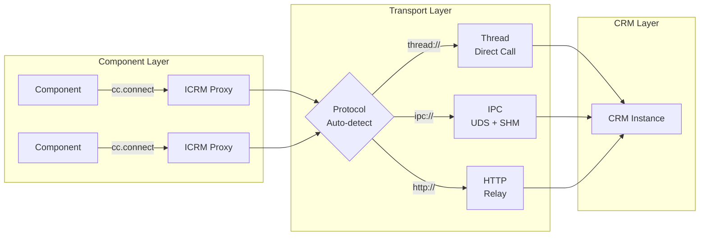

<p align="center">
  
</p>

<h1 align="center">C-Two</h1>

<p align="center">
  A resource-oriented RPC framework for Python — turn stateful classes into location-transparent distributed resources.
</p>

<p align="center">
  <a href="https://pypi.org/project/c-two/"></a>
  
  <a href="LICENSE"></a>
</p>

<p align="center">
  <a href="README.zh-CN.md">中文版</a>
</p>

---

## Basic Idea

- **Resources, not services** — C-Two doesn't expose RPC endpoints. It makes Python classes remotely accessible while preserving their stateful, object-oriented nature.

- **Zero-copy from process to data** — Same-process calls skip serialization entirely. Cross-process IPC can hold shared-memory buffers alive, letting you read columnar data (NumPy, Arrow, …) directly from SHM — no deserialization, no copies.

- **Built for scientific Python** — Native support for Apache Arrow, NumPy arrays, and large payloads (chunked streaming for data beyond 256 MB). Designed for computational workloads, not microservices.

- **Rust-powered transport** — The IPC layer uses a Rust buddy allocator for shared memory and a Rust HTTP relay for high-throughput networking.

---

## Quick Start

```bash
pip install c-two
```

### Define a resource interface and its implementation

```python
import c_two as cc

# Interface — declares which methods are remotely accessible
@cc.icrm(namespace='demo.counter', version='0.1.0')
class ICounter:
    def increment(self, amount: int) -> int: ...

    @cc.read
    def value(self) -> int: ...

    def reset(self) -> int: ...


# Implementation — a plain Python class holding state
class Counter:
    def __init__(self, initial: int = 0):
        self._value = initial

    def increment(self, amount: int) -> int:
        self._value += amount
        return self._value

    def value(self) -> int:
        return self._value

    def reset(self) -> int:
        old = self._value
        self._value = 0
        return old
```

### Use it locally (zero serialization)

```python
cc.register(ICounter, Counter(initial=100), name='counter')
counter = cc.connect(ICounter, name='counter')

counter.increment(10)    # → 110
counter.value()          # → 110
counter.reset()          # → 110 (returns old value)
counter.value()          # → 0

cc.close(counter)
```

### Or remotely — same API, different address

```python
# Server process
cc.set_address('ipc:///tmp/my_server')
cc.register(ICounter, Counter(), name='counter')

# Client process (separate terminal)
counter = cc.connect(ICounter, name='counter', address='ipc:///tmp/my_server')
counter.increment(5)     # works identically
cc.close(counter)
```

> **See [`examples/`](examples/) for complete runnable demos.**

---

## Core Concepts

### ICRM — Interface

An ICRM (Interface of Core Resource Model) declares which CRM methods are remotely accessible. Decorated with `@cc.icrm()`, method bodies are `...` (pure interface — no implementation).

```python
@cc.icrm(namespace='demo.greeter', version='0.1.0')
class IGreeter:
    @cc.read                              # concurrent reads allowed
    def greet(self, name: str) -> str: ...

    @cc.read
    def language(self) -> str: ...
```

Methods can be annotated with `@cc.read` (concurrent access allowed) or left as default write (exclusive access).

### CRM — Core Resource Model

A CRM is a plain Python class that holds state and implements domain logic. It is **not** decorated — the framework discovers its methods through the ICRM interface.

```python
class Greeter:
    def __init__(self, lang: str = 'en'):
        self._lang = lang
        self._templates = {'en': 'Hello, {}!', 'zh': '你好, {}!'}

    def greet(self, name: str) -> str:
        return self._templates.get(self._lang, 'Hi, {}!').format(name)

    def language(self) -> str:
        return self._lang
```

### Component — Consumer

Components consume CRM resources through ICRM proxies. The proxy is location-transparent — it works the same whether the CRM is in the same process or on a remote machine.

```python
greeter = cc.connect(IGreeter, name='greeter')
greeter.greet('World')     # → 'Hello, World!'
cc.close(greeter)
```

### @transferable — Custom Serialization

For custom data types that need to cross the wire, use `@cc.transferable`. Without it, pickle is used as fallback.

A transferable class defines up to three static methods (written without `@staticmethod` — the framework adds it automatically):

| Method | Required | Purpose |
|--------|----------|---------|
| `serialize(data) → bytes` | ✅ Yes | Encode data for wire transfer (outbound) |
| `deserialize(raw) → T` | ✅ Yes | Decode wire bytes into an owned Python object (inbound) |
| `from_buffer(buf) → T` | ❌ Optional | Build a zero-copy view over the raw buffer (inbound, hold mode) |

```python
import numpy as np

@cc.transferable
class Matrix:
    rows: int
    cols: int
    data: np.ndarray

    def serialize(mat: 'Matrix') -> bytes:
        header = struct.pack('>II', mat.rows, mat.cols)
        return header + mat.data.tobytes()

    def deserialize(raw: bytes) -> 'Matrix':
        rows, cols = struct.unpack_from('>II', raw)
        arr = np.frombuffer(raw, dtype=np.float64, offset=8).reshape(rows, cols)
        return Matrix(rows=rows, cols=cols, data=arr.copy())  # owned copy

    def from_buffer(buf: memoryview) -> 'Matrix':
        header = bytes(buf[:8])
        rows, cols = struct.unpack('>II', header)
        arr = np.frombuffer(buf[8:], dtype=np.float64).reshape(rows, cols)
        return Matrix(rows=rows, cols=cols, data=arr)  # zero-copy view into SHM
```

When `from_buffer` is present, the server automatically uses **hold mode** — the SHM buffer stays alive so `from_buffer` can return a zero-copy view. Without `from_buffer`, the server uses **view mode** — the buffer is released immediately after `deserialize`.

### @cc.transfer — Per-Method Control

Use `@cc.transfer()` on ICRM methods to explicitly specify which transferable type handles serialization, or to override the buffer mode:

```python
@cc.icrm(namespace='demo.compute', version='0.1.0')
class ICompute:
    @cc.transfer(input=Matrix, output=Matrix, buffer='hold')
    def transform(self, mat: Matrix) -> Matrix: ...

    @cc.transfer(input=Matrix, buffer='view')  # force copy even if from_buffer exists
    def ingest(self, mat: Matrix) -> None: ...
```

Without `@cc.transfer`, the framework automatically matches registered `@transferable` types by function signature and resolves the buffer mode from the input type's capabilities.

### cc.hold() — Client-Side Zero-Copy

On the client side, `cc.hold()` requests that the response SHM buffer remain alive, enabling zero-copy reads of the result. The returned `HeldResult` wraps the value and provides a three-layer safety net for SHM lifecycle:

1. **Explicit `.release()`** — preferred for complex workflows holding multiple buffers
2. **Context manager (`with`)** — recommended for single-buffer scopes
3. **`__del__` fallback** — last resort, emits `ResourceWarning` if you forget to release

```python
grid = cc.connect(ICompute, name='compute', address='ipc://server')

# Normal call — buffer released immediately after deserialize
result = grid.transform(matrix)

# Option 1: Context manager — clean for single holds
with cc.hold(grid.transform)(matrix) as held:
    data = held.value          # zero-copy NumPy array backed by SHM
    process(data)              # read directly from shared memory
# SHM buffer released on context exit

# Option 2: Explicit release — better for multiple concurrent holds
a = cc.hold(grid.transform)(matrix_a)
b = cc.hold(grid.transform)(matrix_b)
try:
    combined = np.concatenate([a.value.data, b.value.data])
    process(combined)
finally:
    a.release()
    b.release()
```

> **When to use hold mode:** Large array/columnar data where deserialization dominates cost. For small payloads (< 1 MB), the overhead of tracking SHM lifecycle exceeds the copy cost.

---

## Examples

### Single Process — Thread Preference

When `cc.connect()` targets a CRM registered in the same process, the proxy calls methods directly with **zero serialization overhead**.

```python
import c_two as cc

cc.register(IGreeter, Greeter(lang='en'), name='greeter')
cc.register(ICounter, Counter(initial=100), name='counter')

greeter = cc.connect(IGreeter, name='greeter')
counter = cc.connect(ICounter, name='counter')

print(greeter.greet('World'))    # → Hello, World!
print(counter.value())           # → 100
counter.increment(10)

cc.close(greeter)
cc.close(counter)
cc.shutdown()
```

> **Best for:** local prototyping, testing, single-machine computation.

### Multi-Process IPC — with Custom Transferable

Separate server and client processes communicating over Unix domain sockets with shared memory.

**Shared types** (`types.py`):
```python
import c_two as cc
import numpy as np, struct

@cc.transferable
class Mesh:
    n_vertices: int
    positions: np.ndarray   # (N, 3) float64

    def serialize(mesh: 'Mesh') -> bytes:
        header = struct.pack('>I', mesh.n_vertices)
        return header + mesh.positions.tobytes()

    def deserialize(raw: bytes) -> 'Mesh':
        (n,) = struct.unpack_from('>I', raw)
        arr = np.frombuffer(raw, dtype=np.float64, offset=4).reshape(n, 3).copy()
        return Mesh(n_vertices=n, positions=arr)

    def from_buffer(buf: memoryview) -> 'Mesh':
        header = bytes(buf[:4])
        (n,) = struct.unpack('>I', header)
        arr = np.frombuffer(buf[4:], dtype=np.float64).reshape(n, 3)
        return Mesh(n_vertices=n, positions=arr)  # zero-copy view

@cc.icrm(namespace='demo.mesh', version='0.1.0')
class IMeshStore:
    @cc.read
    def get_mesh(self) -> Mesh: ...

    def update_positions(self, mesh: Mesh) -> int: ...

    @cc.on_shutdown
    def cleanup(self) -> None: ...
```

**Server** (`server.py`):
```python
import c_two as cc
from types import IMeshStore, Mesh

class MeshStore:
    def __init__(self):
        self._mesh = Mesh(n_vertices=0, positions=np.empty((0, 3)))

    def get_mesh(self) -> Mesh:
        return self._mesh

    def update_positions(self, mesh: Mesh) -> int:
        self._mesh = mesh
        return mesh.n_vertices

    def cleanup(self):
        print('MeshStore shutting down')

cc.set_address('ipc://mesh_server')
cc.register(IMeshStore, MeshStore(), name='mesh')
cc.serve()  # blocks until interrupted
```

**Client** (`client.py`):
```python
import c_two as cc
from types import IMeshStore, Mesh
import numpy as np

mesh_store = cc.connect(IMeshStore, name='mesh', address='ipc://mesh_server')

# Upload data
big_mesh = Mesh(n_vertices=1_000_000,
                positions=np.random.randn(1_000_000, 3))
mesh_store.update_positions(big_mesh)

# Read with hold — zero-copy SHM access
with cc.hold(mesh_store.get_mesh)() as held:
    positions = held.value.positions  # np.ndarray backed by SHM, no copy
    centroid = positions.mean(axis=0)
    print(f'Centroid: {centroid}')
# SHM released here

cc.close(mesh_store)
```

> **Best for:** multi-process on same host, worker isolation, high-throughput local IPC.

### Cross-Machine — HTTP Relay

An HTTP relay bridges network requests to CRM processes running on IPC.

```python
# CRM Server (resource.py)
cc.set_address('ipc://mesh_server')
cc.register(IMeshStore, MeshStore(), name='mesh')
cc.serve()

# Relay (start via CLI)
# c3 relay --upstream ipc://mesh_server --bind 0.0.0.0:8080

# Client — same API, just change the address
mesh = cc.connect(IMeshStore, name='mesh', address='http://relay-host:8080')
mesh.get_mesh()
cc.close(mesh)
```

> **Best for:** network-accessible services, web integration, cross-machine deployment.

### Function-Based Components

For scripting-style code, `@cc.runtime.connect` injects the ICRM proxy as the first parameter:

```python
@cc.runtime.connect
def compute_centroid(store: IMeshStore) -> np.ndarray:
    mesh = store.get_mesh()
    return mesh.positions.mean(axis=0)

# Framework injects the proxy — caller only passes non-ICRM args
result = compute_centroid(crm_address='ipc://mesh_server')
```

### Server-Side Monitoring

Use `cc.hold_stats()` to monitor SHM buffers held by CRM methods in hold mode:

```python
stats = cc.hold_stats()
# {'active_holds': 3, 'total_held_bytes': 52428800, 'oldest_hold_seconds': 12.5}
```

---

## Architecture

**The design philosophy of C-Two is not to define services, but to empower resources.**

In scientific computation, resources encapsulating complex state and domain-specific operations need to be organized into cohesive units. We call these **Core Resource Models (CRMs)**. Applications care more about *how to interact* with resources than *where they are located*. We call resource consumers **Components**. C-Two provides location transparency and uniform resource access, allowing components to interact with CRMs as if they were local objects.



### Component Layer

Client-side consumers that access remote resources through ICRM proxies. The proxy provides full type safety and location transparency — components don't know (or care) where the CRM is running.

- **Script-based**: `cc.connect(ICRMClass, name='...', address='...')` returns a typed ICRM proxy
- **Function-based**: `@cc.runtime.connect` decorator injects the ICRM proxy as the first parameter

### CRM Layer

Server-side stateful resources exposed through standardized ICRM interfaces.

- **CRM**: Plain Python class — state + domain logic. Not decorated.
- **ICRM**: Interface class decorated with `@cc.icrm()`. Only methods declared here are remotely accessible.
- **`@transferable`**: Custom serialization for domain data types. Optionally provides `from_buffer` for zero-copy SHM views.
- **`@cc.transfer`**: Per-method control over input/output transferable types and buffer mode.
- **`@cc.read` / `@cc.write`**: Concurrency annotations — parallel reads, exclusive writes.
- **`@cc.on_shutdown`**: Lifecycle callback invoked when a CRM is unregistered (not exposed via RPC).

### Transport Layer

Protocol-agnostic communication with automatic protocol detection based on address scheme:

| Scheme | Transport | Use case |
|--------|-----------|----------|
| `thread://` | In-process direct call | Zero serialization, testing |
| `ipc:///path` | Unix domain socket + shared memory | Multi-process, same host |
| `http://host:port` | HTTP relay | Cross-machine, web-compatible |

The IPC transport uses a **control-plane / data-plane separation**: method routing flows through UDS inline frames while payload bytes are exchanged via shared memory — zero-copy on the data path. When `from_buffer` is available, **hold mode** keeps the SHM buffer alive across the CRM method call, enabling the CRM to operate directly on shared memory without deserialization.

### Rust Native Layer

Performance-critical components are implemented in Rust and compiled as a Python extension via [PyO3](https://pyo3.rs) + [maturin](https://www.maturin.rs):

The Rust workspace contains 7 crates organized in 4 layers (foundation → protocol → transport → bridge):

- **Buddy Allocator** — Zero-syscall shared memory allocation for the IPC transport. Cross-process, lock-free on the fast path.
- **Wire Protocol** — Frame encoding, chunk assembly, and chunk registry for large-payload lifecycle management.
- **HTTP Relay** — High-throughput [axum](https://github.com/tokio-rs/axum)-based gateway bridging HTTP to IPC. Handles connection pooling and request multiplexing.

The Rust extension is compiled automatically during `pip install c-two` (from pre-built wheels) or `uv sync` (from source).

---

## Installation

### From PyPI

```bash
pip install c-two
```

Pre-built wheels are available for:
- **Linux**: x86_64, aarch64
- **macOS**: Apple Silicon (aarch64), Intel (x86_64)
- **Python**: 3.10, 3.11, 3.12, 3.13, 3.14, 3.14t (free-threading)

If no pre-built wheel is available for your platform, pip will build from source (requires a [Rust toolchain](https://rustup.rs)).

### Development Setup

```bash
git clone https://github.com/world-in-progress/c-two.git
cd c-two
uv sync          # install dependencies + compile Rust extensions
uv run pytest    # run the test suite
```

> Requires [uv](https://github.com/astral-sh/uv) and a Rust toolchain.

---

## Roadmap

| Feature | Status |
|---------|--------|
| Core RPC framework (CRM / ICRM / Component) | ✅ Stable |
| IPC transport with SHM buddy allocator | ✅ Stable |
| HTTP relay (Rust-powered) | ✅ Stable |
| Chunked streaming (payloads > 256 MB) | ✅ Stable |
| Heartbeat & connection management | ✅ Stable |
| Read/write concurrency control | ✅ Stable |
| Unified config architecture (Python SSOT) | ✅ Stable |
| CI/CD & multi-platform PyPI publishing | ✅ Stable |
| Disk spill for extreme payloads | ✅ Stable |
| Hold mode with `from_buffer` zero-copy | ✅ Stable |
| SHM residence monitoring (`cc.hold_stats()`) | ✅ Stable |
| Async interfaces | 🔜 Planned |
| Cross-language clients (TypeScript/Rust) | 🔮 Future |

See the [full roadmap](docs/plans/c-two-rpc-v2-roadmap.md) for details.

---

## License

[MIT](LICENSE)

---

<p align="center">Built for scientific Python. Powered by Rust.</p>