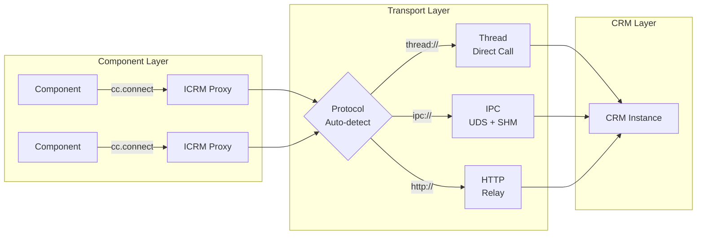

<p align="center">
  
</p>

<h1 align="center">C-Two</h1>

<p align="center">
  A resource-oriented RPC framework for Python — turn stateful classes into location-transparent distributed resources.
</p>

<p align="center">
  <a href="https://pypi.org/project/c-two/"></a>
  
  <a href="LICENSE"></a>
</p>

<p align="center">
  <a href="README.zh-CN.md">中文版</a>
</p>

---

## Basic Idea

- **Resources, not services** — C-Two doesn't expose RPC endpoints. It makes Python classes remotely accessible while preserving their stateful, object-oriented nature.

- **Zero-copy when local, transparent when remote** — Same-process calls skip serialization entirely. Cross-process calls use shared memory. Cross-machine calls go over HTTP. Your code doesn't change.

- **Built for scientific Python** — Native support for Apache Arrow, NumPy arrays, and large payloads (chunked streaming for data beyond 256 MB). Designed for computational workloads, not microservices.

- **Rust-powered transport** — The IPC layer uses a Rust buddy allocator for shared memory and a Rust HTTP relay for high-throughput networking.

---

## Quick Start

```bash
pip install c-two
```

### Define a resource interface and its implementation

```python
import c_two as cc

# Interface — declares which methods are remotely accessible
@cc.icrm(namespace='demo.counter', version='0.1.0')
class ICounter:
    def increment(self, amount: int) -> int: ...

    @cc.read
    def value(self) -> int: ...

    def reset(self) -> int: ...


# Implementation — a plain Python class holding state
class Counter:
    def __init__(self, initial: int = 0):
        self._value = initial

    def increment(self, amount: int) -> int:
        self._value += amount
        return self._value

    def value(self) -> int:
        return self._value

    def reset(self) -> int:
        old = self._value
        self._value = 0
        return old
```

### Use it locally (zero serialization)

```python
cc.register(ICounter, Counter(initial=100), name='counter')
counter = cc.connect(ICounter, name='counter')

counter.increment(10)    # → 110
counter.value()          # → 110
counter.reset()          # → 110 (returns old value)
counter.value()          # → 0

cc.close(counter)
```

### Or remotely — same API, different address

```python
# Server process
cc.set_address('ipc:///tmp/my_server')
cc.register(ICounter, Counter(), name='counter')

# Client process (separate terminal)
counter = cc.connect(ICounter, name='counter', address='ipc:///tmp/my_server')
counter.increment(5)     # works identically
cc.close(counter)
```

> **See [`examples/`](examples/) for complete runnable demos.**

---

## Core Concepts

### ICRM — Interface

An ICRM (Interface of Core Resource Model) declares which CRM methods are remotely accessible. Decorated with `@cc.icrm()`, method bodies are `...` (pure interface — no implementation).

```python
@cc.icrm(namespace='demo.greeter', version='0.1.0')
class IGreeter:
    @cc.read                              # concurrent reads allowed
    def greet(self, name: str) -> str: ...

    @cc.read
    def language(self) -> str: ...
```

Methods can be annotated with `@cc.read` (concurrent access allowed) or left as default write (exclusive access).

### CRM — Core Resource Model

A CRM is a plain Python class that holds state and implements domain logic. It is **not** decorated — the framework discovers its methods through the ICRM interface.

```python
class Greeter:
    def __init__(self, lang: str = 'en'):
        self._lang = lang
        self._templates = {'en': 'Hello, {}!', 'zh': '你好, {}!'}

    def greet(self, name: str) -> str:
        return self._templates.get(self._lang, 'Hi, {}!').format(name)

    def language(self) -> str:
        return self._lang
```

### Component — Consumer

Components consume CRM resources through ICRM proxies. The proxy is location-transparent — it works the same whether the CRM is in the same process or on a remote machine.

```python
greeter = cc.connect(IGreeter, name='greeter')
greeter.greet('World')     # → 'Hello, World!'
cc.close(greeter)
```

### @transferable — Custom Serialization

For custom data types that need to cross the wire, use `@cc.transferable`. Without it, pickle is used as fallback.

```python
@cc.transferable
class GridAttribute:
    level: int
    global_id: int
    elevation: float

    def serialize(data: 'GridAttribute') -> bytes:
        # Custom serialization (e.g., Apache Arrow)
        ...

    def deserialize(raw: bytes) -> 'GridAttribute':
        ...
```

> `serialize` and `deserialize` are written as instance-style methods but are automatically converted to `@staticmethod` by the framework.

---

## Examples

### Single Process — Thread Preference

When `cc.connect()` targets a CRM registered in the same process, the proxy calls methods directly with **zero serialization overhead**.

```python
import c_two as cc

# Register two CRMs in the same process
cc.register(IGreeter, Greeter(lang='en'), name='greeter')
cc.register(ICounter, Counter(initial=100), name='counter')

# Connect — zero-serde thread-local proxies
greeter = cc.connect(IGreeter, name='greeter')
counter = cc.connect(ICounter, name='counter')

print(greeter.greet('World'))    # → Hello, World!
print(counter.value())           # → 100
counter.increment(10)

# Cleanup
cc.close(greeter)
cc.close(counter)
cc.shutdown()
```

> **Best for:** local prototyping, testing, single-machine computation.

### Multi-Process — IPC

Separate server and client processes communicating over Unix domain sockets with shared memory.

**Server** (`server.py`):
```python
import c_two as cc

cc.set_address('ipc://my_server')
cc.register(IGrid, grid_instance, name='grid')
print(f'Listening at {cc.server_address()}')

cc.serve()  # blocks until interrupted
```

**Client** (`client.py`):
```python
import c_two as cc

grid = cc.connect(IGrid, name='grid', address='ipc://my_server')
infos = grid.get_grid_infos(1, [0, 1, 2])
keys = grid.subdivide_grids([1], [0])

cc.close(grid)
cc.shutdown()
```

> **Best for:** multi-process on same host, worker isolation, high-throughput local IPC.

### Cross-Machine — HTTP Relay

An HTTP relay bridges network requests to CRM processes running on IPC.

**CRM Server** (`resource.py`):
```python
import c_two as cc

cc.set_address('ipc://grid_server')
cc.register(IGrid, grid_instance, name='grid')
# Auto-registers with relay when C2_RELAY_ADDRESS is set
cc.serve()
```

**Relay** (`relay.py`):
```python
from c_two.transport.relay import Relay

relay = Relay(bind='127.0.0.1:8080')
relay.start(blocking=True)
```

**Client** (`client.py`):
```python
import c_two as cc

# Same API — just change the address
grid = cc.connect(IGrid, name='grid', address='http://127.0.0.1:8080')
grid.get_grid_infos(1, [0])

cc.close(grid)
```

> **Best for:** network-accessible services, web integration, cross-machine deployment.

---

## Architecture

**The design philosophy of C-Two is not to define services, but to empower resources.**

In scientific computation, resources encapsulating complex state and domain-specific operations need to be organized into cohesive units. We call these **Core Resource Models (CRMs)**. Applications care more about *how to interact* with resources than *where they are located*. We call resource consumers **Components**. C-Two provides location transparency and uniform resource access, allowing components to interact with CRMs as if they were local objects.



### Component Layer

Client-side consumers that access remote resources through ICRM proxies. The proxy provides full type safety and location transparency — components don't know (or care) where the CRM is running.

- **Script-based**: `cc.connect(ICRMClass, name='...', address='...')` returns a typed ICRM proxy
- **Function-based**: `@cc.runtime.connect` decorator injects the ICRM proxy as the first parameter

### CRM Layer

Server-side stateful resources exposed through standardized ICRM interfaces.

- **CRM**: Plain Python class — state + domain logic. Not decorated.
- **ICRM**: Interface class decorated with `@cc.icrm()`. Only methods declared here are remotely accessible.
- **`@transferable`**: Custom serialization for domain data types (e.g., Apache Arrow for scientific data).
- **`@cc.read` / `@cc.write`**: Concurrency annotations — parallel reads, exclusive writes.

### Transport Layer

Protocol-agnostic communication with automatic protocol detection based on address scheme:

| Scheme | Transport | Use case |
|--------|-----------|----------|
| `thread://` | In-process direct call | Zero serialization, testing |
| `ipc:///path` | Unix domain socket + shared memory | Multi-process, same host |
| `http://host:port` | HTTP relay | Cross-machine, web-compatible |

The IPC transport uses a **control-plane / data-plane separation**: method routing flows through UDS inline frames while payload bytes are exchanged via shared memory — zero-copy on the data path.

### Rust Native Layer

Performance-critical components are implemented in Rust and compiled as a Python extension via [PyO3](https://pyo3.rs) + [maturin](https://www.maturin.rs):

- **Buddy Allocator** — Zero-syscall shared memory allocation for the IPC transport. Cross-process, lock-free on the fast path.
- **HTTP Relay** — High-throughput [axum](https://github.com/tokio-rs/axum)-based gateway bridging HTTP to IPC. Handles connection pooling and request multiplexing.

The Rust extension is compiled automatically during `pip install c-two` (from pre-built wheels) or `uv sync` (from source).

---

## Installation

### From PyPI

```bash
pip install c-two
```

Pre-built wheels are available for:
- **Linux**: x86_64, aarch64
- **macOS**: Apple Silicon (aarch64), Intel (x86_64)
- **Python**: 3.10, 3.11, 3.12, 3.13, 3.14, 3.14t (free-threading)

If no pre-built wheel is available for your platform, pip will build from source (requires a [Rust toolchain](https://rustup.rs)).

### Development Setup

```bash
git clone https://github.com/world-in-progress/c-two.git
cd c-two
uv sync          # install dependencies + compile Rust extensions
uv run pytest    # run the test suite
```

> Requires [uv](https://github.com/astral-sh/uv) and a Rust toolchain.

---

## Roadmap

| Feature | Status |
|---------|--------|
| Core RPC framework (CRM / ICRM / Component) | ✅ Stable |
| IPC transport with SHM buddy allocator | ✅ Stable |
| HTTP relay (Rust-powered) | ✅ Stable |
| Chunked streaming (payloads > 256 MB) | ✅ Stable |
| Heartbeat & connection management | ✅ Stable |
| Read/write concurrency control | ✅ Stable |
| CI/CD & multi-platform PyPI publishing | ✅ Stable |
| Async interfaces | 🔜 Planned |
| Disk spill for extreme payloads | ✅ Stable |
| Cross-language clients (Rust/C++) | 🔮 Future |

See the [full roadmap](docs/plans/c-two-rpc-v2-roadmap.md) for details.

---

## License

[MIT](LICENSE)

---

<p align="center">Built for scientific Python. Powered by Rust.</p>