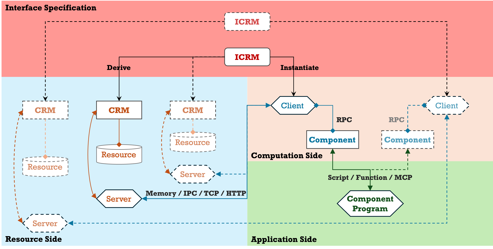

<p align="center">
  
</p>

<h1 align="center">C-Two</h1>

<p align="center">
  A resource-oriented RPC runtime — turn stateful classes into location-transparent distributed resources.
</p>

<p align="center">
  <a href="https://pypi.org/project/c-two/"></a>
  <a href="https://pypi.org/project/c-two/"></a>
  
  <a href="https://github.com/world-in-progress/c-two/actions/workflows/ci.yml"></a>
  <a href="LICENSE"></a>
</p>

<p align="center">
  <a href="README.zh-CN.md">中文版</a>
</p>

---

## Basic Idea

- **Resource-oriented RPC** — C-Two exposes stateful resource objects through language SDKs. The Python SDK makes Python classes remotely accessible while preserving their object-oriented nature.

- **Explicit transport and payload lifetimes** — Same-process calls skip serialization. Cross-process IPC can use shared memory for transport, while the current portable FastDB receive path opens an owned copy and uses checked owner/view invalidation. Direct construction into the final response backing is not claimed.

- **Built for scientific workloads** — Portable CRM payloads use FastDB; Python-only prototypes can still use ordinary Python values. Large payloads use chunked transfer for data beyond 256 MB. The runtime is designed for computational workflows and stateful scientific resources.

- **Rust-powered core** — Shared transport, memory, wire codec, route-contract validation, relay, and configuration live in Rust so future SDKs reuse one runtime contract.

---

## Performance

The portable-payload foundation currently has correctness, deterministic codegen, lifetime, and real Rust/Python interoperability proof. It does **not** yet have a reviewed throughput benchmark for the explicit `Payload` API, retained owners, or direct/staged backing.

The tracked Kostya benchmark keeps Python-only `pickle-records` and `pickle-arrays` baselines. Results produced by the removed annotation-inferred FastDB integration are historical and are not valid performance claims for the current architecture. A reproducible portable-payload benchmark, including honest copy/direct/staged labels and environment/statistical reporting, remains an explicit [deferred capability](docs/issues/contract-release-deferred-capabilities.md).

---

## Quick Start

> **Development-build requirement:** This line uses FastDB 0.2.0. The examples require this C-Two checkout or matching development artifacts; the published C-Two package does not contain the complete portable-payload and Windows integration. See [Development Setup](#development-setup), [Windows build inputs and usage](docs/windows-native-usage.md), and the [historical local-candidate report](docs/reports/2026-07-24-rust-sdk-portable-payload-local-release-candidate.md) for the earlier, separately pinned package proof.

### Define an explicit portable-payload contract

```python
import json

import c_two as cc
from fastdb4py.payload import BuildPolicy, Builder, CompiledSpec, Payload


VALUE_SPEC = {
    "schema": "fastdb.payload.v1",
    "profile": "record.v1",
    "entries": [
        {
            "id": "value",
            "cardinality": "one",
            "type": {"kind": "u8", "nullable": False},
        },
    ],
    "components": [],
}


@cc.crm(namespace="demo.payload", version="0.1.0")
class Echo:
    @cc.transfer(input=VALUE_SPEC, output=VALUE_SPEC)
    def echo(self, payload: Payload) -> Payload:
        ...

    def ping(self) -> None:
        ...
```

`c-two.contract.v2` embeds `VALUE_SPEC` as an opaque nested JSON value. C-Two owns the outer method/binding contract and delegates the nested value unchanged to FastDB Core, which owns validation, canonical identity, binary/runtime behavior, and payload-only codegen.

### Build and use a payload

```python
def build_value(value: int) -> Payload:
    spec = CompiledSpec.compile(json.dumps(VALUE_SPEC).encode())
    builder = Builder.create(spec)
    builder.entry_begin(0, 1).value_u8(value)
    plan = builder.freeze()
    builder.close()
    try:
        return plan.execute(BuildPolicy.ALLOW_STAGING).payload
    finally:
        plan.close()
        spec.close()


class EchoResource:
    def echo(self, payload: Payload) -> Payload:
        return payload

    def ping(self) -> None:
        return None


cc.register(Echo, EchoResource(), name="echo")
source = build_value(7)
try:
    with cc.connect(Echo, name="echo") as echo:
        result = echo.echo(source)
        result.close()
        assert echo.ping() is None
finally:
    source.close()
    cc.shutdown()
```

This minimal same-process run assumes no relay anchor. If the checkout's
`.env` configures one and no relay is running, launch the script with
`C2_RELAY_ANCHOR_ADDRESS=` so registration remains local.

The same CRM contract is used in-process, over IPC, or through a relay. Ordinary methods without an explicit portable binding can still use pickle for Python-only prototypes, but portable export and codegen reject them.

---

## Rust SDK (Local Candidate)

The user-facing Rust SDK lives at `sdk/rust`:

```text
Cargo package: c-two
Rust import:   c_two
version:       0.1.0
publish:       false
```

It reuses the language-neutral `c2-core` client and host for direct IPC, explicit relay, and relay-aware calls. Portable values remain official `fastdb::Payload` owners; C-Two does not rename or reimplement FastDB semantics. Owned, held, and generated-service input paths are copy-backed. Held response release invalidates the FastDB owner before releasing its C-Two lease.

Generated Rust artifacts now target the supported `c_two` seam and expose typed clients, service traits, and registration helpers without assembling low-level transport crates. The same no-payload, record, object-graph, contract, route, error, and lifetime capabilities are projected through Python; the checked-in [12-row parity receipt](docs/reports/evidence/sdk-capability-parity.v1.json) makes the one intentional Python-only pickle/thread-local difference explicit.

This is a complete local candidate, not a crates.io release. Its version-only Rust package, CPython 3.10/current wheels, and Node tarballs pass isolated consumers outside the source and sibling checkouts:

```bash
cargo test --manifest-path sdk/rust/Cargo.toml --all-features
cargo run --manifest-path sdk/rust/Cargo.toml --example client
cargo run --manifest-path sdk/rust/Cargo.toml --example host
```

See [`sdk/rust/README.md`](sdk/rust/README.md) for the ownership boundary.
See the [candidate report](docs/reports/2026-07-24-rust-sdk-portable-payload-local-release-candidate.md) for exact commits, artifact hashes, the 18/18 Rust/Python matrix, 12/12 generated TypeScript Node matrix, and remaining release limits.

---

## Core Concepts

### CRM — Contract

A **CRM** (Core Resource Model) declares *which* methods a remote resource exposes. It's decorated with `@cc.crm()`, and method bodies are `...` (pure interface — no implementation).

```python
@cc.crm(namespace="demo.payload", version="0.1.0")
class Echo:
    @cc.transfer(input=VALUE_SPEC, output=VALUE_SPEC)
    def echo(self, payload: Payload) -> Payload:
        ...
```

Methods can be annotated with `@cc.read` (concurrent access allowed) or left as default write (exclusive access). A portable method declares its nested FastDB input/output specification explicitly with `@cc.transfer(...)` and carries zero or one `Payload` envelope in each direction.

### Resource — Runtime Instance

A **resource** is a plain Python class that implements a CRM contract. It holds state and domain logic. No decorator is required; the framework discovers its methods through the CRM contract it was registered under. Use domain names such as `EchoResource`.

In the example above, `EchoResource` is the resource object. The CRM contract fixes the portable payload boundary; the resource implementation receives and returns official FastDB `Payload` owners.

### Client — Consumer

Anything that calls `cc.connect(...)` is a **client** (or consumer / application code). The returned proxy is location-transparent — it works the same whether the resource lives in the same process or on a remote machine.

```python
echo = cc.connect(Echo, name="echo")
result = echo.echo(source)
result.close()
cc.close(echo)

# Or with context manager:
with cc.connect(Echo, name="echo") as echo:
    assert echo.ping() is None
```

### Server — Resource Host

A **server** is any process that calls `cc.register(...)` to host one or more resources, then usually `cc.serve()` to block on the request loop. One server process can host many resources (each under a unique `name`), and will auto-bind an IPC endpoint the first time a resource is registered.

```python
import c_two as cc

cc.register(Echo, EchoResource(), name="echo")
cc.serve()                                     # blocks; Ctrl-C triggers graceful shutdown
```

- **Server ID** identifies the local IPC server instance. C-Two generates one on first registration unless you call `cc.set_server(server_id=...)` before registering.
- **Address** (`ipc://...`) is the internal local transport endpoint derived from the server ID. Inspect it with `cc.server_address()` only when a same-host process needs to connect directly.
- **`cc.serve()`** is optional — if your host process has its own event loop (web server, GUI, simulation), you can register resources and let them serve in the background while your main loop runs.
- A process can be both a server and a client at the same time (register some resources, connect to others).

### Relay — Distributed Discovery

An **HTTP relay** (`c3 relay`) is a lightweight broker that lets clients reach servers **by route name and CRM contract**, across machines. Servers announce their IPC address plus CRM tag and contract fingerprints to the relay when they register; clients ask the relay with the route name and the expected CRM contract derived from `cc.connect(CRMClass, name='...')`.

The `c3` command is C-Two's cross-language native CLI. From a source checkout, build and link a local development binary with `python tools/dev/c3_tool.py --build --link`. For released binaries, install the latest `c3` with:

```bash
curl -fsSL https://github.com/world-in-progress/c-two/releases/latest/download/c3-installer.sh | sh
```

The Python SDK leaves relay lifecycle to `c3 relay`, Docker Compose, or your orchestrator. Point Python code at the relay anchor with `C2_RELAY_ANCHOR_ADDRESS` or `cc.set_relay_anchor()`. The anchor is the control-plane registration/name-resolution endpoint. Remote HTTP calls still go directly to the resolved route's `relay_url`; local direct IPC is used only when the anchor endpoint is loopback/local. Relay-aware clients preflight routes before the first call and re-resolve structured stale-route responses; set `C2_RELAY_ROUTE_MAX_ATTEMPTS` to tune the maximum route acquisition attempts (default `3`, valid range `1..=32`, `0` is treated as `1`). Set `C2_RELAY_CALL_TIMEOUT` to tune CRM call timeout seconds (default `300`; `0` disables the reqwest total timeout). Set `C2_REMOTE_PAYLOAD_CHUNK_SIZE` to tune C-Two remote payload batching for relay HTTP and future remote protocols (default `1048576`; max `134217728`). This setting controls C-Two payload batching, separate from TCP packet, HTTP/1 chunk, or HTTP/2 DATA frame boundaries. Ambiguous data-plane failures require caller-level retry policy. Relay resolve, probe, and call paths require route name plus CRM contract and reject mismatches.

```bash
# Start a relay anywhere reachable on your network
c3 relay --bind 0.0.0.0:8080
```

Relay HTTP and mesh endpoints are intended for a trusted network boundary. Production deployments should restrict access with infrastructure such as private networking, firewalls, Kubernetes NetworkPolicy, service mesh policy, or ingress authentication.

```python
# Server side — announce resources to the relay
cc.set_relay_anchor('http://relay-host:8080')
cc.register(Echo, EchoResource(), name='echo')
cc.serve()

# Client side — resolve by name plus the Echo CRM contract, no address needed
cc.set_relay_anchor('http://relay-host:8080')
echo = cc.connect(Echo, name='echo')
```

Multiple relays can form a **mesh cluster** via gossip — any relay can resolve any resource registered anywhere in the mesh. The runnable example is listed in [Runnable Examples](#runnable-examples).

> **When do I need a relay?** Use a relay for cross-machine or name-and-contract-based discovery. Same-process and same-host IPC usage can connect directly.

### Contract Releases — Persistent Identity

A runtime route identifies one active resource instance; it is not a durable CRM contract release. C-Two derives a route-independent `ContractReleaseRef` from the canonical validated `c-two.contract.v2` descriptor so catalogs and lockfiles can retain exact contract identity before a route exists and after it disappears.

```python
descriptor = cc.export_contract_descriptor(Echo)
release_ref = cc.export_contract_release_ref(Echo)
```

The language-neutral Rust CLI produces the same reference directly from descriptor JSON without starting Python:

```bash
c3 contract release-ref contract.json
```

The reference contains the descriptor schema, CRM namespace/name/version, and canonical descriptor SHA-256; it deliberately contains no route. The digest proves content identity and integrity, not publisher identity, authorization, revocation status, or trust. C-Two does not provide a contract registry, storage location, or resolver: a consumer must resolve descriptor bytes through its own catalog or deployment layer, reconstruct and verify the `ContractRelease`, and only then add a runtime route name. See the [deferred-capabilities issue](docs/issues/contract-release-deferred-capabilities.md) for the explicit compatibility, trust, Rust SDK, and FastDB Rust-runtime boundaries.

### Payload Model — Explicit FastDB Delegation

Portable methods use an explicit nested `fastdb.payload.v1` specification and the official `fastdb4py.payload.Payload` owner. `c-two.contract.v2` is a super-schema: it owns CRM methods, parameters, return shape, and input/output binding relationships, while each binding's `spec` remains an opaque JSON value until FastDB Core compiles it.

FastDB Core is the sole authority for nested schema/profile/type meaning, canonical bytes and digest, binary layout, builders, record/object-graph views, materialization, invalidation, and payload-only C++/Rust/Python/TypeScript codegen. C-Two owns route and release identity, transport, scheduler/lease lifecycle, generated CRM adapters, and final multi-owner artifact composition. It never reproduces FastDB's parser or runtime.

A portable method carries exactly zero or one payload envelope in each direction:

```python
@cc.crm(namespace="demo.payload", version="0.1.0")
class Echo:
    @cc.transfer(input=VALUE_SPEC, output=VALUE_SPEC)
    def echo(self, payload: Payload) -> Payload: ...
```

Python-only resources may still use ordinary Python annotations and pickle for local prototypes. Those methods are intentionally diagnosed as nonportable and rejected by portable descriptor export/codegen.

### cc.hold() — Client-Side Retained Ownership

On the client side, the proven portable receive path opens a copy-backed FastDB `Payload`. `cc.hold()` retains the C-Two response lease together with that payload owner and guarantees that `held.release()` invalidates the FastDB owner and its checked views before releasing the lease. This is a lifetime guarantee, not a claim that FastDB built or views data directly in the response SHM. The returned `cc.Held[Payload]` also exposes the retained raw wire buffer as `.unsafe_buffer` for advanced use and provides a three-layer safety net:

1. **Explicit `.release()`** — preferred for complex workflows holding multiple buffers
2. **Context manager (`with`)** — recommended for single-buffer scopes
3. **`__del__` fallback** — last resort, emits `ResourceWarning` if you forget to release

```python
echo = cc.connect(Echo, name='echo', address='ipc://server')

# Normal call — returns an owned Payload.
result = echo.echo(source)

# Retained call — checked views remain valid until release.
with cc.hold(echo.echo)(source) as held:
    payload = held.value
    with payload.entry_view(0) as values:
        with values.at(0) as value:
            assert value.get_u8() == 7
```

`held.value` is the normal API. FastDB checked views fail after `held.release()`. `held.unsafe_buffer` is a raw `memoryview` escape hatch; raw NumPy arrays or pointers derived from that buffer bypass FastDB owner checks and cannot be revoked mechanically. Materialize through FastDB before retaining logical values beyond the hold scope.

---

### InputLifetime — Server-Side Borrowed Inputs

On the server side, portable inputs are owned by default. `cc.InputLifetime.BORROWED` is an explicit call-scoped lifetime policy for a resource method whose CRM signature accepts `Payload`; C-Two invalidates that payload and its checked views before releasing the request lease when the call returns or raises.

Do not retain a borrowed payload or checked view after the method returns. Materialize the needed FastDB value while the call is active. Raw pointer or buffer aliases remain explicitly unsafe.

## Runnable Examples

The quick start above shows the end-to-end authoring pattern. The repository examples provide runnable process layouts:

| Scenario | Entry points |
| --- | --- |
| Same-process local call | [`examples/python/local.py`](examples/python/local.py) |
| Direct IPC resource/client | [`examples/python/ipc_resource.py`](examples/python/ipc_resource.py), [`examples/python/ipc_client.py`](examples/python/ipc_client.py) |
| Relay mesh | [`examples/python/relay_mesh/`](examples/python/relay_mesh/) |
| Python-only grid prototype | [`examples/python/grid/`](examples/python/grid/) |
| Portable payload runtime and lifetime proof | [`sdk/python/tests/integration/test_portable_payload_runtime.py`](sdk/python/tests/integration/test_portable_payload_runtime.py) |
| Rust/Python generated-artifact interoperability proof | [`sdk/python/tests/integration/test_portable_payload_cross_language.py`](sdk/python/tests/integration/test_portable_payload_cross_language.py) |

### Server-Side Monitoring

Use `cc.hold_stats()` to monitor retained response-buffer leases:

```python
stats = cc.hold_stats()
# {'active_holds': 3, 'total_held_bytes': 52428800, 'oldest_hold_seconds': 12.5}
```

---

## Architecture

**C-Two organizes distributed programs around resources.**

In scientific computation, resources encapsulating complex state and domain-specific operations need to be organized into cohesive units. We call the contracts describing these resources **Core Resource Models (CRMs)**. Applications care more about *how to interact* with resources than *where they are located*. C-Two provides location transparency and uniform resource access, so any **client** can interact with a resource as if it were a local object.

<p align="center">
  
</p>

### Client Layer

Any code that calls `cc.connect(...)` consumes a resource. The returned proxy provides full type safety and location transparency, so client code can use the resource without tracking its process or machine placement.

- `cc.connect(CRMClass, name='...', address='...')` returns a typed CRM proxy
- The proxy supports context management: `with cc.connect(...) as x:` auto-closes
- For IPC and relay paths, the SDK derives the expected route contract from the CRM class and native code validates the route name, CRM tag, ABI hash, and signature hash before calls are made.

### Resource Layer

Server-side stateful instances exposed through standardized CRM contracts.

- **CRM contract**: Interface class decorated with `@cc.crm()`. Only methods declared here are remotely accessible.
- **Resource**: Plain Python class implementing the contract — state + domain logic, with no decorator required.
- **Portable payloads**: `@cc.transfer(...)` binds one explicit nested FastDB specification to a `fastdb4py.payload.Payload` input and/or output.
- **Python pickle fallback**: Plain Python types remain usable for Python-only prototyping, but strict portable export rejects them.
- **`@cc.read` / `@cc.write`**: Concurrency annotations — parallel reads, exclusive writes.
- **`@cc.on_shutdown`**: Lifecycle callback invoked when a resource is unregistered; it stays outside the RPC surface.

### Transport Layer

Protocol-agnostic communication with automatic protocol detection based on address scheme:

| Scheme | Transport | Use case |
|--------|-----------|----------|
| `thread://` | In-process direct call | Zero serialization, testing |
| `ipc://server` | Unix domain socket or Windows Named Pipe + native shared memory | Multi-process, same host |
| `http://host:port` | HTTP relay | Cross-machine, web-compatible |

The IPC transport separates its control and data paths: method routing uses local stream frames (Unix UDS or Windows Named Pipes), while payload bytes can be exchanged through native shared mappings. The current portable FastDB receive path is copy-backed. `cc.hold()` and `cc.InputLifetime.BORROWED` provide explicit invalidation/lease boundaries without implying direct FastDB construction in transport memory. See [Windows development builds and usage](docs/windows-native-usage.md) and [the implementation record](docs/windows-native-implementation.md) for execution evidence.

### Rust Native Layer

The core runtime is language-neutral Rust, and SDKs bind to the same core contracts. Performance-critical components are implemented in Rust and exposed to Python through a native extension built with [PyO3](https://pyo3.rs) + [maturin](https://www.maturin.rs):

The Rust workspace is organized in four layers (foundation → protocol → transport → runtime), plus the Python PyO3 extension under `sdk/python/native/`:

- **Contract Core (`c2-contract`)** — Language-neutral `c-two.contract.v2` validation, canonical descriptor hashing, release identity, and opaque nested-spec extraction.
- **Contract Codegen (`c2-codegen`)** — Delegates nested specs to the official FastDB Rust projection, verifies returned artifacts, composes C-Two and FastDB outputs deterministically, and publishes a complete new tree.
- **Buddy Allocator** — Allocation and release use a cross-process atomic lock in shared memory. A dead or panicking holder cannot authorize further mutations of potentially incomplete allocator state.
- **Wire Protocol** — Frame encoding, chunk assembly, and chunk registry for large-payload lifecycle management.
- **HTTP Relay** — High-throughput [axum](https://github.com/tokio-rs/axum)-based gateway bridging HTTP to IPC. Handles connection pooling and request multiplexing.

The released Rust extension is installed by `pip install c-two` from a
pre-built wheel, or built from source by `uv sync`. This does not override the
portable-package distribution limitation above: the complete v2/FastDB
integration is currently source-checkout-only.

The `c3` command is distributed as a native CLI binary and built from the root `cli/` package. Install released binaries with:

```bash
curl -fsSL https://github.com/world-in-progress/c-two/releases/latest/download/c3-installer.sh | sh
```

Source checkouts can link a local development binary with `python tools/dev/c3_tool.py --build --link`; published CLI artifacts are owned by the CLI release pipeline.

Portable CRM descriptors can be exported from Python CRM classes and validated by the Rust CLI before they are used as codegen input:

```bash
uv run python -m c_two.cli.contract export mypkg.contracts:Geometry --out geometry.contract.json
c3 contract diagnose mypkg.contracts:Geometry --python .venv/bin/python --pretty
c3 contract export mypkg.contracts:Geometry --python .venv/bin/python --out geometry.contract.json
c3 contract validate geometry.contract.json
c3 contract release-ref geometry.contract.json --out geometry.release-ref.json
```

`c3 contract diagnose` reports Python-only pickle methods before portable export fails, and the Rust CLI validates diagnostic output before writing it. The validated v2 descriptor already contains each nested FastDB specification; there is no separate sidecar or second payload-schema input. Generate a complete fresh project tree for one supported C-Two target:

```bash
c3 contract codegen rust geometry.contract.json --out-dir generated-rust
c3 contract codegen python geometry.contract.json --out-dir generated-python
c3 contract codegen typescript geometry.contract.json --out-dir generated-typescript
```

Each destination must be absent. Generation first validates the outer contract, delegates every nested value to FastDB Core, verifies hashes and paths, then publishes one deterministic tree containing:

- `metadata/contract.json`
- `metadata/contract-release-ref.json`
- `metadata/composition-manifest.json`
- the target-specific C-Two contract module
- FastDB Core-owned payload modules under binding-specific `payloads/` paths

Python can consume the same in-memory authority path:

```python
artifacts = cc.compile_contract_artifacts(descriptor, target="rust")
```

For resource-first projects, `c3 contract infer ... --diagnose` can expose why selected ordinary Python methods remain Python-only. A portable contract is authored explicitly with `@cc.transfer(...)`; inference does not synthesize FastDB structures from domain annotations.

---

## Installation

### From PyPI

```bash
pip install c-two
```

This installs the latest published C-Two runtime. It does not yet provide the complete portable-payload surface documented above; do not treat a successful registry install as evidence that the audited local candidate is available.

Pre-built wheels are available for:

- **Linux**: x86_64, aarch64
- **macOS**: Apple Silicon (aarch64), Intel (x86_64)
- **Python**: 3.10, 3.11, 3.12, 3.13, 3.14, 3.14t (free-threading)

If no pre-built wheel is available for your platform, pip will build from source. This requires a [Rust toolchain](https://rustup.rs) and the matching [FastDB Core SDK](https://github.com/world-in-progress/fastdb/releases/tag/v0.2.1), configured with the system-link settings below.

### Development Setup

```bash
git clone https://github.com/world-in-progress/c-two.git
cd c-two
# Python and Rust dependencies resolve the published FastDB 0.2.1 packages.
# The full source-based interoperability tests also need its fixtures and
# TypeScript sources in a sibling checkout:
git clone --branch v0.2.1 --depth 1 https://github.com/world-in-progress/fastdb.git ../fastdb
# Extract the matching FastDB Core SDK release archive first.
export FASTDB_PAYLOAD_LINK_MODE=system
export FASTDB_PAYLOAD_SYSTEM_LIB_DIR=/absolute/path/to/fastdb-core-sdk/lib
case "$(uname -s)" in
  Darwin) export DYLD_LIBRARY_PATH="$FASTDB_PAYLOAD_SYSTEM_LIB_DIR${DYLD_LIBRARY_PATH:+:$DYLD_LIBRARY_PATH}" ;;
  Linux) export LD_LIBRARY_PATH="$FASTDB_PAYLOAD_SYSTEM_LIB_DIR${LD_LIBRARY_PATH:+:$LD_LIBRARY_PATH}" ;;
esac
cp .env.example .env               # configure environment (optional)
uv sync                            # install dependencies + compile Rust extensions
uv sync --group examples           # install examples dependencies (pandas, pyarrow)
python tools/dev/c3_tool.py --build --link  # build and link native c3 for source checkouts
uv run pytest                      # run the test suite

# Python 3.10 compatibility check. C-Two keeps 3.10 support for downstream
# stacks such as Taichi that are still pinned to that runtime.
uv python install 3.10
uv run pytest sdk/python/tests/unit/test_python_examples_syntax.py::test_python_examples_compile_on_minimum_supported_python -q --timeout=30 -rs
```

> Requires [uv](https://github.com/astral-sh/uv) and a Rust toolchain.

---

## Roadmap

| Capability | Status |
|------------|--------|
| Core RPC framework (CRM + Resource + Client) | ✅ Stable |
| IPC transport with SHM buddy allocator | ✅ Stable |
| HTTP relay (Rust-powered) | ✅ Stable |
| Relay mesh with gossip-based discovery | ✅ Stable |
| Chunked payload transfer (payloads > 256 MB) | ✅ Stable |
| Heartbeat & connection management | ✅ Stable |
| Read/write concurrency control | ✅ Stable |
| Unified config architecture (Rust resolver SSOT) | ✅ Stable |
| CI/CD & multi-platform PyPI publishing | ✅ Stable |
| Disk spill for extreme payloads | ✅ Stable |
| `c-two.contract.v2` + Core-owned artifact composition | ✅ Proven locally |
| Language-neutral `c2-core` route/transport/lifecycle authority | ✅ Proven locally |
| Supported `c-two` / `c_two` Rust SDK with generated clients/services | ✅ Proven locally |
| Rust/Python exact portable capability parity | ✅ Proven locally |
| 18/18 Rust/Python direct/relay candidate matrix | ✅ Proven locally |
| 12/12 generated TypeScript Node real-call matrix | ✅ Proven locally |
| Isolated Rust/Python/Node local package closure | ✅ Proven locally |
| FastDB owner/view invalidation through `cc.hold()` | ✅ Proven locally |
| SHM residence monitoring (`cc.hold_stats()`) | ✅ Stable |
| Route-independent contract release identity | ✅ Stable |
| Immutable portable-package distribution | 🔜 Planned |
| Contract version compatibility negotiation | 🔜 Planned |
| `auth_hook` + call metadata | 🔜 Planned |
| Dry-run hooks | 🔜 Planned |
| Async interfaces | 🔜 Planned |
| Adaptive memory lifecycle policy | 🔜 Planned |
| Streaming RPC / pipeline semantics | 🔜 Planned |
| Publishable TypeScript SDK and browser runtime | 🔮 Future |
| Global discovery & namespace governance | 🔮 Future |

See the [current roadmap](docs/roadmap.md) for details. Historical roadmap notes remain archived under `docs/plans/`.

---

## License

[MIT](LICENSE)

---

<p align="center">Built for resource-oriented computation. Powered by Rust.</p>
