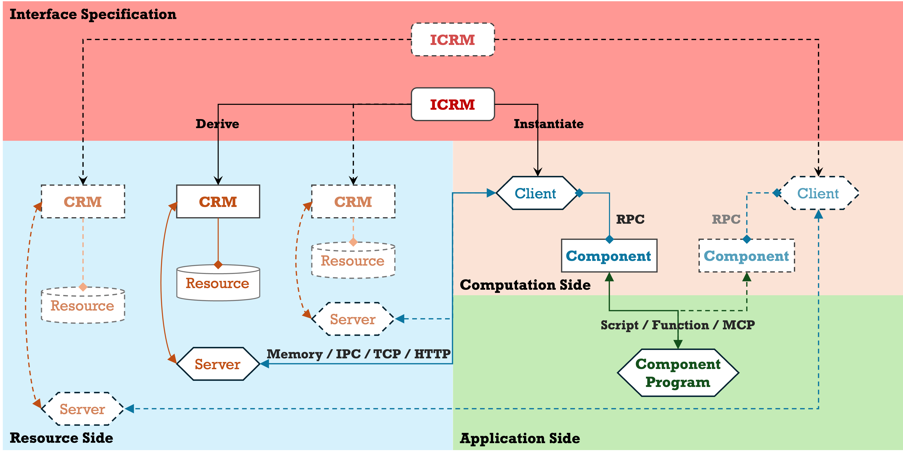

<p align="center">
  
</p>

<h1 align="center">C-Two</h1>

<p align="center">
  面向资源的 RPC runtime — 将有状态对象转变为位置透明的分布式资源。
</p>

<p align="center">
  <a href="https://pypi.org/project/c-two/"></a>
  <a href="https://pypi.org/project/c-two/"></a>
  
  <a href="https://github.com/world-in-progress/c-two/actions/workflows/ci.yml"></a>
  <a href="LICENSE"></a>
</p>

<p align="center">
  <a href="README.md">English</a>
</p>

---

## 基本理念

- **面向资源的 RPC** — C-Two 通过语言 SDK 暴露有状态 resource object。Python SDK 让 Python 类在保持面向对象特性的同时具备远程访问能力。

- **从进程到数据的零拷贝** — 同进程调用完全跳过序列化。跨进程 IPC 可以保持共享内存缓冲区存活，让 FastDB checked view 在调用方显式 retained response 时直接读取 SHM 上的列式数据。

- **为科学计算而生** — portable CRM payload 使用 FastDB；Python-only prototype 仍可使用普通 Python 值。超过 256 MB 的大体量载荷使用分块传输。runtime 面向计算工作流和有状态科学资源设计。

- **Rust 驱动的 runtime core** — 共享 transport、memory、wire codec、route-contract validation、relay 和配置解析都在 Rust 中实现，让后续 SDK 复用同一套 runtime contract。

---

## 性能

端到端跨进程 IPC 基准测试，Kostya-style 坐标 schema：`row_id u32`、`x/y/z f64`、`name STR`。每次调用从远端进程返回缓存坐标表，客户端计算 `sum(x + y + z)`。

| 行数 | FDB control default (ms) | FDB recommended default (ms) | FDB control retained (ms) | FDB recommended retained (ms) | Ray arrays (ms) | C-Two pickle arrays (ms) | **Recommended retained vs Ray arrays** |
|-----:|---:|---:|---:|---:|---:|---:|---:|
| 1 K | 1.28 | 1.33 | 1.30 | **1.12** | 6.51 | 0.57 | **5.8×** |
| 10 K | 1.83 | 1.27 | 1.52 | **1.26** | 7.42 | 1.24 | **5.9×** |
| 100 K | 5.10 | 2.64 | 4.91 | **1.91** | 8.22 | 9.69 | **4.3×** |
| 1 M | 36.39 | 12.29 | 29.85 | **8.36** | 48.59 | 130.65 | **5.8×** |
| 3 M | 147.89 | 39.08 | 93.80 | **23.29** | 164.32 | 529.47 | **7.1×** |

Row-oriented fallback 路径在大规模数据下明显更慢，这里只用于展示 Python object materialization 成本：

| 行数 | C-Two pickle records (ms) | Ray records (ms) | **Recommended retained vs Ray records** |
|-----:|---:|---:|---:|
| 1 K | 0.95 | 6.23 | **5.6×** |
| 10 K | 6.09 | 11.62 | **9.2×** |
| 100 K | 67.25 | 56.31 | **29.5×** |
| 1 M | 861.50 | 546.27 | **65.3×** |
| 3 M | SKIP | SKIP | - |

- **FDB control** — 普通 `fdb.Batch.allocate(...)` 资源实现；作为 benchmark control 保留，用来展示资源输出在 CRM call envelope 外构建时的 call-db repack 成本。
- **FDB recommended** — 资源实现使用 `fdb.require(fdb.batch(...))`；3M 行 default-call p50 从 147.89 ms 降到 39.08 ms。
- **Default / retained** — default call 会在脱离 transport buffer 后返回 owned logical value；retained call 使用 `cc.hold(...)`，让 FastDB checked view 在 release 前直接读取 retained response buffer。
- **Ray arrays** — Ray object store 传输 NumPy 列和 `name` 字符串列表。
- **Pickle arrays / records** — Python-only fallback baselines；records 特意覆盖 row-oriented Python object 开销。

上表中的 FastDB 行比较同一套 C-Two 资源模型内的不同构造路径：CRM contract -> resource instance -> typed client proxy。

> Apple M1 Max · measured May 27, 2026 · C-Two: Python 3.14.3 + NumPy 2.4.4 · Ray: Python 3.12 + NumPy 2.4.6 + Ray 2.55.1 · 完整方法见 [`sdk/python/benchmarks/kostya_ctwo_benchmark.py`](sdk/python/benchmarks/kostya_ctwo_benchmark.py)、[`sdk/python/benchmarks/kostya_ray_benchmark.py`](sdk/python/benchmarks/kostya_ray_benchmark.py) 和 [`sdk/python/benchmarks/run_kostya_sweep.sh`](sdk/python/benchmarks/run_kostya_sweep.sh)。

---

## 快速开始

```bash
pip install c-two
```

### 定义 FastDB-first 资源契约

```python
import c_two as cc
import fastdb4py as fdb
import numpy as np


@fdb.feature
class Vertex:
    vertex_id: fdb.U32
    x: fdb.F64
    y: fdb.F64
    z: fdb.F64


@fdb.feature
class Node:
    node_id: fdb.U32
    weight: fdb.F64
    anchor: Vertex
    neighbors: list[Vertex]


@cc.crm(namespace='demo.geometry', version='0.1.0')
class Geometry:
    @cc.read
    def vertices(self, count: fdb.I32) -> fdb.Batch[Vertex]:
        ...

    @cc.read
    def nodes(self) -> fdb.Batch[Node]:
        ...
```

`vertices()` 是固定规模列式路径；`nodes()` 是表达嵌套资源数据的对象图路径。

### 实现资源对象

```python
class GeometryResource:
    def vertices(self, count: fdb.I32) -> fdb.Batch[Vertex]:
        n = int(count)
        batch = fdb.require(fdb.batch(Vertex, rows=n))
        idx = np.arange(n, dtype=np.uint32)
        xyz = idx.astype(np.float64)
        batch.fill(vertex_id=idx, x=xyz, y=xyz + 10.0, z=xyz + 20.0)
        return batch

    def nodes(self) -> fdb.Batch[Node]:
        vertices = [
            Vertex(vertex_id=0, x=0.0, y=10.0, z=20.0),
            Vertex(vertex_id=1, x=1.0, y=11.0, z=21.0),
            Vertex(vertex_id=2, x=2.0, y=12.0, z=22.0),
        ]

        batch = fdb.Batch.allocate(Node, 0)
        batch.append(Node(
            node_id=100,
            weight=0.5,
            anchor=vertices[0],
            neighbors=[vertices[1], vertices[2]],
        ))
        return batch
```

### 本地使用（零序列化）

```python
cc.register(Geometry, GeometryResource(), name='geometry')

with cc.connect(Geometry, name='geometry') as geometry:
    vertices = geometry.vertices(1_000)
    nodes = geometry.nodes()
```

### 跨进程使用同一套客户端 API

```python
# 服务端进程
cc.set_relay_anchor('http://relay-host:8080')
cc.register(Geometry, GeometryResource(), name='geometry')

# 客户端进程（另一个终端）
cc.set_relay_anchor('http://relay-host:8080')
with cc.connect(Geometry, name='geometry') as geometry:
    vertices = geometry.vertices(1_000_000)
```

同一个 CRM contract 可以用于进程内调用、IPC 调用或 relay 调用。Client code 在这些模式下都调用 typed proxy。Portable payload 使用 FastDB 类型编写；普通 Python 值可用于本地 Python-only prototype。

---

## 核心概念

### CRM — 契约

**CRM**（Core Resource Model）声明远程资源暴露*哪些*方法。使用 `@cc.crm()` 装饰，方法体为 `...`（纯接口，无实现）。

```python
@cc.crm(namespace='demo.geometry', version='0.1.0')
class Geometry:
    @cc.read
    def vertices(self, count: fdb.I32) -> fdb.Batch[Vertex]:
        ...

    @cc.read
    def nodes(self) -> fdb.Batch[Node]:
        ...
```

方法可标注 `@cc.read`（允许并发访问）或保持默认的 write（独占访问）。Portable 方法输入输出使用 FastDB scalar alias、`fdb.Array[...]`、`fdb.Batch[...]` 和 FastDB feature class。

### Resource — 运行时实例

**Resource** 是实现 CRM 契约的普通 Python 类，持有状态和领域逻辑。它无需装饰器；框架通过注册时绑定的 CRM 契约发现其方法。命名应体现领域语义，例如 `GeometryResource`。

上方示例中的 `GeometryResource` 就是 resource object。CRM contract 保持 FastDB-first；resource implementation 只是返回 FastDB 值的普通 Python 代码。

### Client — 消费者

任何调用 `cc.connect(...)` 的代码都是 **client**（即 consumer / 应用代码）。返回的代理是位置透明的 — 无论资源运行在同进程还是远程机器，用法完全相同。

```python
geometry = cc.connect(Geometry, name='geometry')
vertices = geometry.vertices(1_000)
cc.close(geometry)

# 或使用上下文管理器：
with cc.connect(Geometry, name='geometry') as geometry:
    nodes = geometry.nodes()
```

### Server — 资源宿主

**Server** 是调用 `cc.register(...)` 托管一个或多个资源、并通常调用 `cc.serve()` 进入请求循环的进程。单个 server 进程可以托管任意多的资源（每个使用唯一的 `name`），并在首次注册时自动绑定一个 IPC 端点。

```python
import c_two as cc

cc.register(Geometry, GeometryResource(), name='geometry')
cc.serve()                                     # 阻塞；Ctrl-C 触发优雅关闭
```

- **Server ID** 标识本地 IPC server 实例。C-Two 会在首次注册时自动生成；也可以在注册前调用 `cc.set_server(server_id=...)` 显式设置。
- **地址**（`ipc://...`）是由 Server ID 推导出的内部本地传输端点；只有同主机进程需要直连时才需要用 `cc.server_address()` 查看。
- **`cc.serve()` 是可选的** — 如果宿主进程已有自己的事件循环（Web 服务、GUI、模拟器），你可以只注册资源，让它们在后台服务，同时你的主循环照常运行。
- 一个进程可以**同时**是 server 和 client（注册一些资源，同时连接另一些）。

### Relay — 分布式发现

**HTTP 中继**（`c3 relay`）是一个轻量级代理，让客户端可以按**路由名和 CRM 契约**跨机器访问服务端。服务端在注册时向中继通告自己的 IPC 地址、CRM tag 和契约指纹；客户端使用路由名以及从 `cc.connect(CRMClass, name='...')` 派生出的预期 CRM 契约查询中继。

`c3` 是 C-Two 的跨语言原生 CLI。从源码 checkout 开发时，可以用 `python tools/dev/c3_tool.py --build --link` 构建并链接本地开发二进制。正式发布版可以通过 installer 安装最新 `c3`：

```bash
curl -fsSL https://github.com/world-in-progress/c-two/releases/latest/download/c3-installer.sh | sh
```

Python SDK 将 relay 生命周期交给 `c3 relay`、Docker Compose 或编排系统。Python 代码通过 `C2_RELAY_ANCHOR_ADDRESS` 或 `cc.set_relay_anchor()` 连接 relay anchor。anchor 是控制面注册和名称解析端点；远程 HTTP 调用仍会直连解析得到的 `relay_url`，只有 anchor 是 loopback/local 端点时才会选择本地 direct IPC。relay-aware 客户端会在首次调用前预检 route，并在收到结构化 stale-route 响应时重新解析路由；可通过 `C2_RELAY_ROUTE_MAX_ATTEMPTS` 调整最大 route acquisition 尝试次数（默认 `3`，有效范围 `1..=32`，`0` 按 `1` 处理）。可通过 `C2_RELAY_CALL_TIMEOUT` 调整 CRM 调用超时秒数（默认 `300`；`0` 禁用 reqwest 总超时）。可通过 `C2_REMOTE_PAYLOAD_CHUNK_SIZE` 调整 relay HTTP 和未来远程协议的 C-Two 远程载荷批大小（默认 `1048576`；最大 `134217728`）。这个设置控制 C-Two payload batching，独立于 TCP packet、HTTP/1 chunk 或 HTTP/2 DATA frame 边界。语义不明确的数据面失败需要调用方自定义 retry policy。relay resolve、probe 和 call 路径要求 route name 与 CRM contract 同时匹配，并拒绝契约不匹配的路由。

```bash
# 在网络可达的任意节点启动中继
c3 relay --bind 0.0.0.0:8080
```

Relay HTTP 与 mesh 端点应只暴露在可信网络边界内。生产部署应通过私有网络、防火墙、Kubernetes NetworkPolicy、service mesh 策略或 ingress 认证等基础设施限制访问。

```python
# 服务端 — 将资源通告给中继
cc.set_relay_anchor('http://relay-host:8080')
cc.register(Geometry, GeometryResource(), name='geometry')
cc.serve()

# 客户端 — 按路由名和 CRM 契约解析，无需显式地址
cc.set_relay_anchor('http://relay-host:8080')
geometry = cc.connect(Geometry, name='geometry')
```

多个中继可以通过 gossip 协议组成**网格集群** — 网格中任意中继都能解析整个集群内注册的任何资源。可运行示例见 [可运行示例](#可运行示例)。

> **何时需要中继？** 跨机器访问或按路由名与 CRM 契约发现时使用 relay。同进程和同主机 IPC 可以直接连接。

### FastDB-first payload

Portable CRM payload 使用 `fastdb4py` 声明。CRM 签名保持逻辑类型：`fdb.I32`、`fdb.Array[...]`、`fdb.Batch[...]` 和 `@fdb.feature` 会规划成 FastDB call-db ABI；未标记的 Python 类型可在 Python-only prototype 路径中走 pickle，strict portable export/codegen 会拒绝它。

Payload ABI 位于 C-Two resource-first 架构之下。FastDB 拥有 schema、storage layout、view 和面向 allocator 的 payload 构建语义。C-Two 拥有 CRM route contract、transport、retained-buffer lease 以及 contract/codegen orchestration；runtime 的 route/relay/IPC/scheduler 层把 FastDB payload 视作 opaque ABI-backed bytes，不解析 FastDB 存储内部结构。

这里聚焦两种 FastDB CRM 形态：

- `vertices() -> fdb.Batch[Vertex]`：固定规模列式 feature batch，是 retained-view、高吞吐路径。
- `nodes() -> fdb.Batch[Node]`：包含 nested feature 和 list 的对象图 batch，仍是 portable FastDB call-db data，retained-view profile 与固定列式数据不同。

```python
@fdb.feature
class Vertex: ...

@fdb.feature
class Node:
    anchor: Vertex
    neighbors: list[Vertex]

@cc.crm(namespace='demo.geometry', version='0.1.0')
class Geometry:
    def vertices(self, count: fdb.I32) -> fdb.Batch[Vertex]: ...
    def nodes(self) -> fdb.Batch[Node]: ...
```

固定规模列式输出的具体写法见快速开始中的 `GeometryResource.vertices()`。

C-Two 会把 CRM 推导出的 FastDB binding 交给 FastDB；用户代码保持在逻辑 `Batch`、`Array`、scalar 和 feature 类型层面。

Python-only resource 仍可使用普通 Python annotation 和 pickle 做本地 prototype。这类方法会被 strict contract export/codegen 诊断为 nonportable。

### cc.hold() — 客户端零拷贝

在客户端，普通 FastDB CRM 调用会先把响应 payload copy 到进程自有缓冲区，再暴露逻辑 FastDB 值并立即释放 transport buffer。`cc.hold()` 显式请求保留响应缓冲区，使支持 retained view 的 FDB 输出可以零拷贝读取。返回的 `cc.Held[R]` 包装 CRM 逻辑返回值，并把保留中的原始 wire buffer 作为 `.unsafe_buffer` 暴露给高级用户。

1. **显式 `.release()`** — 推荐用于同时持有多个缓冲区的复杂工作流
2. **上下文管理器（`with`）** — 推荐用于单缓冲区作用域
3. **`__del__` 兜底** — 最后手段，若忘记释放会触发 `ResourceWarning`

```python
geometry = cc.connect(Geometry, name='geometry', address='ipc://server')

# Normal call — transport release 后暴露 owned logical value。
vertices = geometry.vertices(1_000_000)

# Retained call — columnar FastDB view 直接读取 retained response。
with cc.hold(geometry.vertices)(1_000_000) as held:
    vertices = held.value
    z_mean = vertices.column.z.to_numpy().mean()
```

`held.value` 是普通 API，会尽量使用 FastDB checked views；`held.release()` 后，子行和列视图会 fail fast。`held.unsafe_buffer` 是原始 `memoryview` escape hatch；从该 buffer 派生出的 NumPy/raw pointer 会绕过 FastDB owner check。需要跨越 hold 生命周期保存数据时，用 `fdb.materialize(...)` 物化。

`nodes()` 这类对象图 response 仍是 portable FastDB payload。当前 runtime 会返回 materialized logical values，并且没有 retained columnar `held.unsafe_buffer`。

> **何时使用持有模式：** 适用于反序列化开销占主导的大型数组/列式数据。对于小载荷（< 1 MB），跟踪共享内存生命周期的开销超过拷贝成本。

---

### InputLifetime — 服务端 borrowed input

服务端 FastDB input 默认会在调用 resource method 前物化。只有当 resource method 的 FDB input 签名和 CRM 一致，并且明确准备把参数当作 call-scoped borrowed data 处理时，才使用 `input_lifetime={...}`。

`cc.InputLifetime.BORROWED` 只适用于支持 buffer-view 的 FDB payload。它与 `bridge.input` 分开使用；调用结束后仍需保留的数据必须先用 `fastdb4py.materialize(value)` 或 `value.to_owned()` 拷贝。旧的 transfer/hold 装饰器不参与这个 registration policy。

---

## 可运行示例

快速开始已经展示完整 authoring pattern。仓库中的 examples 提供可直接运行的进程布局：

| 场景 | 入口 |
| --- | --- |
| 同进程本地调用 | [`examples/python/local.py`](examples/python/local.py) |
| Direct IPC resource/client | [`examples/python/ipc_resource.py`](examples/python/ipc_resource.py), [`examples/python/ipc_client.py`](examples/python/ipc_client.py) |
| FastDB CRM 与 relay client | [`examples/python/fastdb_relay_resource.py`](examples/python/fastdb_relay_resource.py), [`examples/python/fastdb_relay_client.py`](examples/python/fastdb_relay_client.py) |
| Relay mesh | [`examples/python/relay_mesh/`](examples/python/relay_mesh/) |
| FastDB bridge 示例 | [`examples/python/grid/`](examples/python/grid/) |

### 服务端监控

使用 `cc.hold_stats()` 监控持有模式下资源方法所持有的共享内存缓冲区：

```python
stats = cc.hold_stats()
# {'active_holds': 3, 'total_held_bytes': 52428800, 'oldest_hold_seconds': 12.5}
```

---

## 架构

**C-Two 围绕 resource 组织分布式程序。**

在科学计算中，封装复杂状态和领域特定操作的资源需要被组织为内聚的单元。我们称描述这些资源的契约为 **核心资源模型（CRM）**。应用程序以 *如何与资源交互* 为中心，同时由 C-Two 处理资源所在位置带来的访问差异。C-Two 提供位置透明和统一的资源访问，使任何 **client** 都能像访问本地对象一样与资源交互。

<p align="center">
  
</p>

### 客户端层

调用 `cc.connect(...)` 消费资源的任何代码。返回的代理提供完整的类型安全和位置透明性，client code 可以在不跟踪进程或机器位置的情况下使用 resource。

- `cc.connect(CRMClass, name='...', address='...')` 返回类型化的 CRM 代理
- 代理支持上下文管理：`with cc.connect(...) as x:` 自动关闭
- 对 IPC 与 relay 路径，SDK 从 CRM class 推导 expected route contract，native 层在调用前校验 route name、CRM tag、ABI hash 和 signature hash。

### 资源层

服务端有状态的实例，通过标准化的 CRM 契约暴露。

- **CRM 契约**：使用 `@cc.crm()` 装饰的接口类。只有在此声明的方法才可被远程访问。
- **Resource**：实现契约的普通 Python 类 — 状态 + 领域逻辑，无需装饰器。
- **FastDB payload**：使用 `fastdb4py` feature、scalar、`Array[...]` 和 `Batch[...]` 作为 portable CRM ABI。
- **Python fallback**：普通 Python 类型可用于 Python-only prototype，但 portable export/codegen 会拒绝 pickle fallback。
- **`@cc.read` / `@cc.write`**：并发注解 — 并行读取，独占写入。
- **`@cc.on_shutdown`**：生命周期回调，在资源被注销时调用；它位于 RPC surface 之外。

### 传输层

协议无关的通信，基于地址方案自动检测协议：

| 协议方案 | 传输方式 | 适用场景 |
|----------|----------|----------|
| `thread://` | 进程内直接调用 | 零序列化、测试 |
| `ipc:///path` | Unix 域套接字 + 共享内存 | 多进程、同主机 |
| `http://host:port` | HTTP 中继 | 跨机器、Web 兼容 |

IPC 传输采用 **控制面 / 数据面分离**：方法路由通过 UDS 内联帧传输，载荷字节通过共享内存交换。`cc.hold()` 可以在客户端显式保留响应缓冲区，使 FastDB checked views 直接映射在 transport buffer 上；服务端 borrowed input 只能通过 `cc.register(..., input_lifetime={...})` 显式启用。

### Rust 原生层

核心 runtime 是语言中立的 Rust，SDK 绑定到同一套 core contract。性能关键组件通过 [PyO3](https://pyo3.rs) + [maturin](https://www.maturin.rs) 暴露给 Python：

Rust 工作空间包含 9 个 core crates，按 4 层组织（foundation → protocol → transport → runtime），Python PyO3 extension 位于 `sdk/python/native/`：

- **Contract Core (`c2-contract`)** — 语言中立的 CRM route contract validation 和 canonical descriptor hashing。
- **伙伴分配器** — IPC 传输的零系统调用共享内存分配。跨进程，快速路径上无锁。
- **线协议** — 帧编码、分块组装和分块注册表，管理大载荷的生命周期。
- **HTTP 中继** — 基于 [axum](https://github.com/tokio-rs/axum) 的高吞吐网关，桥接 HTTP 到 IPC。处理连接池和请求多路复用。

Rust 扩展在 `pip install c-two`（从预编译 wheel）或 `uv sync`（从源码）时自动编译。

`c3` 作为原生 CLI 二进制分发，并由根目录下的 `cli/` 包构建。正式发布版可以通过 installer 安装：

```bash
curl -fsSL https://github.com/world-in-progress/c-two/releases/latest/download/c3-installer.sh | sh
```

源码 checkout 开发时可以通过 `python tools/dev/c3_tool.py --build --link` 链接本地开发二进制；正式 CLI 产物由独立的 CLI release 流水线负责。

Portable CRM descriptor 可以从 Python CRM 类导出，并在作为 codegen 输入前交给 Rust CLI 校验：

```bash
uv run python -m c_two.cli.contract export mypkg.contracts:Geometry --out geometry.contract.json
c3 contract artifacts mypkg.contracts:Geometry --python .venv/bin/python --out geometry.payload-abi-artifacts.json
c3 contract diagnose mypkg.contracts:Geometry --python .venv/bin/python --pretty
c3 contract export mypkg.contracts:Geometry --python .venv/bin/python --out geometry.contract.json
c3 contract validate geometry.contract.json
```

`c3 contract diagnose` 会在严格跨语言工作流失败前报告 fastdb-first portability warning，例如 Python-only pickle fallback 或非 FastDB 的 `PayloadAbiRef`；Rust CLI 写出 diagnostics 前会要求 Python diagnostics 是 JSON object array。`c3 contract artifacts` 导出 FastDB ABI sidecar descriptor，例如 `fastdb.call-db.schema.v1` 以及 root/dependency `fastdb.schema.v1` 对象；C-Two runtime 的 route/relay/IPC/scheduler/lease 层继续把 FastDB 存储内部结构视为 opaque。把这个 artifact bundle 直接交给 C-Two codegen 的 `--fastdb-schema` 和 `--fastdb-out`：

```bash
c3 contract codegen typescript \
  geometry.contract.json \
  --out geometry.client.ts \
  --fastdb-schema geometry.payload-abi-artifacts.json \
  --fastdb-out geometry.fastdb.ts
```

通过校验的 descriptor 可以生成 TypeScript client。FastDB-backed payload 会生成 method wire specs、route fingerprints、codec transport factory、显式 relay URL 的 `createHttpRelayEncodedTransport(...)`，以及带 contract-scoped relay resolve、完整 contract-key route cache、current-route preference、payload-limit guardrail、stale-route invalidation/re-resolve、resolve transport-error/5xx retry、data-plane transport-error classification、`maxAttempts`、`routeCacheTtlMs`、`callTimeoutMs`、`resolveTimeoutMs`、HTTP option/base URL/fetch/header 构造期校验和 C-Two expected-contract 保留 header 保护的 `createRelayAwareHttpEncodedTransport(...)`。如果 CI 需要在所有 FastDB ABI requirement 都有 generated TypeScript 支持前失败，可以使用 `--strict-codecs`：

```bash
c3 contract codegen typescript geometry.contract.json --out geometry.client.ts
c3 contract codegen typescript geometry.contract.json --strict-codecs
```

对于资源优先项目，`infer` 可以从显式选择的 Python 资源方法构造 CRM 投影 descriptor。推断只暴露被选择的方法，并且 fastdb-first portable 工作流要求每个被选择的方法 payload 解析为 FastDB call-db `PayloadAbiRef` 或无 payload。Python-native primitive/container 适合 Python-only prototype；它们会回退到 `python-pickle-default` 并被 portable export 拒绝。显式的非 FastDB `PayloadAbiRef` 属于内部诊断场景。可以先用 `c3 contract infer --diagnose` 查看 inferred projection 上的 diagnostics，再用 `c3 contract infer --artifacts` 从同一 inferred projection 导出 FastDB ABI artifacts 给 C-Two codegen 使用，最后导出 portable descriptor：

```bash
c3 contract infer mypkg.resources:GeometryResource \
  --python .venv/bin/python \
  --namespace mypkg.geometry \
  --version 0.1.0 \
  --name Geometry \
  --method vertices \
  --method nodes \
  --diagnose \
  --pretty

c3 contract infer mypkg.resources:GeometryResource \
  --python .venv/bin/python \
  --namespace mypkg.geometry \
  --version 0.1.0 \
  --name Geometry \
  --method vertices \
  --method nodes \
  --artifacts \
  --out geometry.payload-abi-artifacts.json

c3 contract infer mypkg.resources:GeometryResource \
  --python .venv/bin/python \
  --namespace mypkg.geometry \
  --version 0.1.0 \
  --name Geometry \
  --method vertices \
  --method nodes \
  --out geometry.contract.json
```

FastDB call-db 是 portable CRM payload ABI。Python fallback 路径使用普通 Python annotation 和 pickle，只面向本地或 Python-only IPC prototype；strict portable export/codegen 会明确拒绝它。公开包 surface 省略可选 payload registry module 和公开 codec registry。

如果要让方法进入 portable 路径，请使用 `fastdb4py` scalar、`Array[...]`、`Batch[...]` 和 FastDB feature class，让方法规划为 FastDB call-db。未标记的 Python payload 仍可在非 portable 的本地/IPC prototype 路径中通过 pickle 使用；strict portable export 会拒绝 pickle 和非 FastDB `PayloadAbiRef`。扩展 schema 代码位于可运行 FastDB 示例中。

---

## 安装

### 从 PyPI 安装

```bash
pip install c-two
```

预编译 wheel 支持：
- **Linux**：x86_64、aarch64
- **macOS**：Apple Silicon (aarch64)、Intel (x86_64)
- **Python**：3.10、3.11、3.12、3.13、3.14、3.14t（自由线程）

如果没有适合你平台的预编译 wheel，pip 将从源码编译（需要 [Rust 工具链](https://rustup.rs)）。

### 开发环境

```bash
git clone https://github.com/world-in-progress/c-two.git
cd c-two
cp .env.example .env               # 配置环境变量（可选）
uv sync                            # 安装依赖 + 编译 Rust 扩展
uv sync --group examples           # 安装示例依赖（pandas、pyarrow）
python tools/dev/c3_tool.py --build --link  # 在源码检出中构建并链接原生 c3 CLI
uv run pytest                      # 运行测试套件

# Python 3.10 compatibility check. 下游 Taichi 等栈仍可能固定在 3.10。
uv python install 3.10
uv run pytest sdk/python/tests/unit/test_python_examples_syntax.py::test_python_examples_compile_on_minimum_supported_python -q --timeout=30 -rs
```

> 需要 [uv](https://github.com/astral-sh/uv) 和 Rust 工具链。

---

## 路线图

| 能力 | 状态 |
|------|------|
| 核心 RPC 框架（CRM + Resource + Client） | ✅ 稳定 |
| IPC 传输 + SHM 伙伴分配器 | ✅ 稳定 |
| HTTP 中继（Rust 驱动） | ✅ 稳定 |
| 中继网格与 gossip 路由发现 | ✅ 稳定 |
| 分块载荷传输（载荷 > 256 MB） | ✅ 稳定 |
| 心跳与连接管理 | ✅ 稳定 |
| 读/写并发控制 | ✅ 稳定 |
| 统一配置架构（Rust resolver 单一事实源） | ✅ 稳定 |
| CI/CD 与多平台 PyPI 发布 | ✅ 稳定 |
| 极端载荷磁盘溢出 | ✅ 稳定 |
| `cc.hold()` 与 FastDB retained views | ✅ 稳定 |
| 共享内存驻留监控（`cc.hold_stats()`） | ✅ 稳定 |
| 契约版本兼容协商 | 🔜 规划中 |
| `auth_hook` 与 call metadata | 🔜 规划中 |
| dry-run 钩子 | 🔜 规划中 |
| 异步接口 | 🔜 规划中 |
| 自适应内存生命周期策略 | 🔜 规划中 |
| Streaming RPC / pipeline 语义 | 🔜 规划中 |
| 跨语言客户端（Rust 优先，TypeScript 随后） | 🔮 远期 |
| 全局发现与命名空间治理 | 🔮 远期 |

详见[当前路线图](docs/roadmap.zh-CN.md)。历史路线图笔记仍归档在 `docs/plans/` 下。

---

## 开源协议

[MIT](LICENSE)

---

<p align="center">为科学计算而生，由 Rust 驱动。</p>
