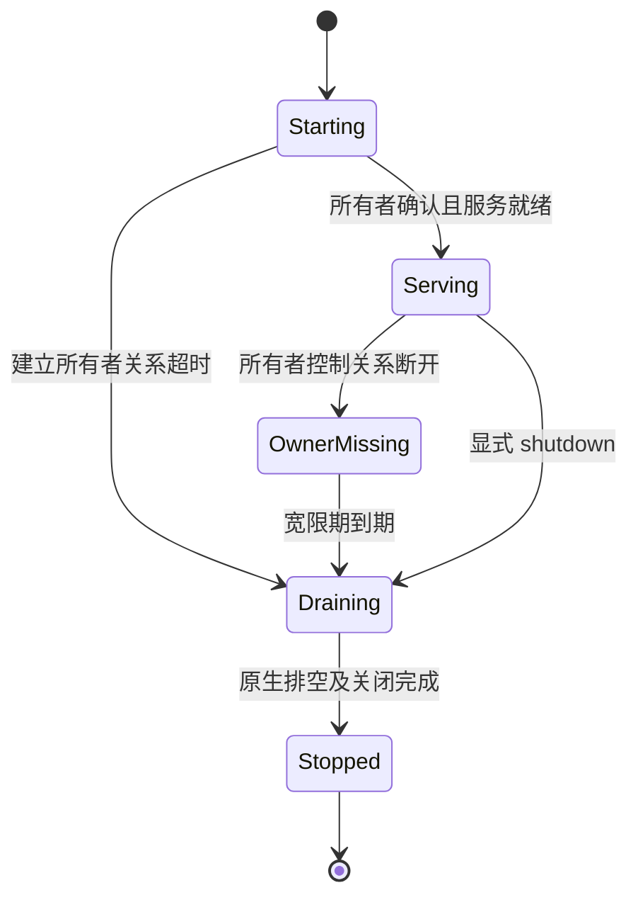

# 本地 IPC 端点生命周期与残留回收方案

方案日期：2026-10-06。2026-10-07 状态：C-Two 实施候选已完成原生、SDK、CLI 和跨平台验收。固定实现源码为 `bbfdbf48cb78d66eccccbc8ad7d33771b9dae344`，FastDB 为 `4f99f86a662b0e950a0dd29800c25a1c9fca4def`；后续文档提交不是产物源码。具体平台、测试、产物哈希及边界见[最终验收报告](../reports/local-endpoint-final-validation.md)，运行器用法见[接入说明](../local-endpoint-lifecycle.md)。PR、合并和正式发布另行决定。

实现采用显式 `managed-v2`，实际目录格式为 `v2.2`，gate/marker 格式 2 以随机 nonce 防止 inode 复用误认；默认仍为 `legacy-v1`。OwnerBound 使用不可重连的私有继承通道，EOF 后暂停准入并进入排空，没有恢复或跨控制器接管。C-Two 已提供运行器接口和真实 Python/Rust 子进程证明；已安装 hey-my-buddy 的调用方接入属于该项目的后续工作。历史未知端点和未完整登记的崩溃对象保持保守处理，本次没有清扫历史目录。

建议采用三层机制：服务正常结束时主动清理；运行器通过显式所有者关系管理专用服务；C-Two 对异常退出留下的、身份可验证的端点执行安全回收。常驻服务继续由显式 shutdown 决定退出，普通业务连接断开不改变服务生命周期。

## 设计时的基线与问题边界

源码基线为 main `8777e2dd157942fe6f3cc90389763af35f5056bd`；内存优化分支的文档提交 `01667b8b02f2fb447628b96b4d9236897300e81f` 使用相同的 `c2-local` 和 `LocalEndpoint` 实现。

- [Unix Listener](../../core/transport/c2-local/src/unix.rs) 正常 Drop 时核对 socket 的设备号、inode 和 ctime，再尝试 unlink；当前删除错误被忽略。
- 异常退出后，只有再次绑定同一地址才调用 `remove_stale_socket`。回收要求取得独占 flock，并核对记录的 socket 身份。连接失败本身不能授权删除，尤其不能把监听队列已满误判为死亡。
- [自动服务 ID](../../core/runtime/c2-core/src/identity.rs) 含 PID 和随机 UUID，新服务通常不会再访问旧地址。
- 每地址 `.lock` 目前永久保留，防止并发参与者分别锁住删除前后的不同 inode。正常结束的测试也会留下这类文件。
- [LocalEndpoint](../../core/foundation/c2-config/src/local.rs) 把 Unix 地址映射到 `/tmp/c_two_ipc`，没有运行范围隔离或目录清扫接口。Windows 使用 Named Pipe 和独立内核监听租约，不存在同样的 socket 文件清扫问题。

2026-10-06 的一次只读目录快照有 6,738 个 socket，其中 6,734 个超过三天；另有 7,521 个锁文件，其中 7,512 个没有对应 socket，6,729 个 socket 没有配套锁文件。该快照只证明目录积累，不能证明具体端点死亡，也不能确定所有文件的生成版本。

现有测试证明了正常重启、无析构退出后的同地址重启、并发重绑的唯一赢家及满 backlog 保护；没有证明持续生成新地址时文件数量能够收敛。

## 必须保持的语义

1. 监听地址属于一个服务实例，一条业务连接只拥有自身流句柄。最后一个业务客户端离开后，常驻服务仍可接待新客户端。
2. 自动回收只能处理已确认由 C-Two 管理且不再被监听者持有的具体对象。年龄、PID、ping 失败、路径不存在均不能单独证明进程退出、业务排空或清理权限。
3. 关闭、回收、重连及延迟回调都绑定实例 incarnation，旧实例的清理请求不得删除新实例。
4. 删除 socket 目录项不表示在途回调已结束，也不表示 SHM、文件载荷或 held/borrowed lease 已释放。端点回收不得顺带清理这些载荷资源。
5. 同一端点只有一个监听所有者。所有权租约必须覆盖监听句柄的真实关闭；已建立的普通客户端流不延长监听租约。
6. 默认路径不增加按 RPC 执行的文件扫描、锁竞争或连接计数判定。回收成本发生在生命周期边界和有预算的维护操作中。

## 一、主动收尾：常驻服务与受控服务

生命周期策略由 Rust `c2-core` 管理，经 `c2-config` 验证和冻结。实现使用 `Persistent`（默认）与 `OwnerBound`（显式启用）。

`Persistent` 复用现有 Runtime shutdown 和 route drain。提升清理结果的可观测性：显式关闭返回端点清理结果；Drop 只能做有界的尽力清理，失败留下可重试证据。不得在 Drop 中无限等待或创建无界后台任务。

`OwnerBound` 只用于由一个控制器独占管理的服务进程。共享多个运行的常驻 Buddy worker、共享 relay 或托管其他资源的 Runtime 不能因为某一次任务结束而进入此模式。控制器必须在启动时明确拥有整个 Runtime 的关闭权限。

所有者关系使用独立的本地控制能力，不能复用池化业务连接、HTTP keep-alive、relay 上游连接或业务心跳。优先调查可由控制器显式传递的私有本地控制通道；只向目标子进程传递必要句柄，避免无关后代继承而延长所有者存活。可重连通道必须验证当前实例及所有者能力，普通 CRM 客户端不能取得或续期它。能力不得放入日志、公共服务地址或进程命令行。第一版不提供跨控制器接管。

OwnerBound 的所有者能力与既有 direct IPC `ShutdownClient` 管理入口分别定义。当前本机 IPC 访问者可以显式调用后者；它属于高权限本机管理操作。引入 OwnerBound 不等于已经为现有 shutdown 增加独立认证。普通业务流的断开与显式管理关闭也必须分别测试。

控制通道已选择不可重连的私有继承能力，EOF 后只进入排空。恢复需要另行实现实例/epoch 绑定与能力校验的原生重新附着协议；当前不暴露这样的入口。

受控服务在所有者关系建立前不对外宣布业务就绪。建立超时应进入关闭流程，不能留下无人管理的服务。

`OwnerMissing` 暂停新的业务准入，允许既有工作按原有规则推进，并保留监听所有权。宽限期由 Rust 验证为 0 至 60 秒，运行器按需显式选择，例如 3 秒；它为排空协调留时间，不提供重连窗口。重复 EOF、显式关闭和旧回调由同一个 Rust 状态机处理，不能影响新实例。

进入 `Draining` 后不得恢复接单。停止新业务准入、处理既有路由和请求、关闭监听器、释放监听租约及报告收尾结果，全部复用 Rust 的关闭事务与屏障。业务准入关闭与回收文件是两个不同动作；不能在尚有回调执行时释放端点所有权、允许另一实例抢占同一身份。

排空 deadline 到期只产生“尚未完成”的结构化结果，不能强行释放仍被回调或载荷使用的资源。运行器若按自身策略终止服务，必须等待操作系统确认该子进程退出，再请求端点回收。shutdown initiate 的 ACK、socket 消失或 ping 失败都不能替代退出/排空证明。没有外部运行器的进程继续报告未完成，不伪造 `Stopped`。

观察结果必须分别表示监听器关闭、服务端工作排空和本地载荷 lease 计数。服务端 `Stopped` 不证明客户端的 held 输出已经释放，也不等待所有进程外 held 引用归零；客户端按实际载荷所有者的规则释放。OS wait 证明目标进程退出，同样不证明其他进程的 lease 已释放。端点回收不改变这些条件。

普通连接断开、连接池 idle 驱逐、relay 重连、请求取消均不触发 `OwnerBound` 退出。关闭 hook 仍由 SDK 消费原生关闭结果后执行一次。

## 二、原生端点回收接口

`c2-local` 负责判定和执行，`c2-config::LocalEndpoint` 继续是地址到 OS 名称的唯一来源。Rust/Python SDK 和运行器只传递逻辑地址及原生返回的端点凭据，不拼接文件名，也不直接 unlink。

实现提供三种原生能力，SDK 签名见接入说明：

| 能力 | 输入与结果 | 约束 |
| --- | --- | --- |
| `inspect_endpoint` | 逻辑地址、可选实例凭据；返回原生观察结果 | 不创建锁文件、不发业务请求、不宣称仅靠路径知道进程是否存活 |
| `reap_endpoint` | 精确地址与预期端点凭据；返回结构化结果 | 面向运行器收尾；实例变化必须返回 `StaleTarget` |
| `sweep_endpoints` | 当前用户的托管命名空间、时间/条目预算、续扫位置 | 仅原生层读取并验证已记录对象；不能接受任意递归删除目录 |

端点凭据需绑定命名空间、服务实例 incarnation、所有权协议版本和 OS 对象身份。现有 v1 记录没有完整 incarnation，第一阶段必须以实际记录的 socket 身份约束操作，不把路径或 PID 包装成更强的证明。

回收结果区分 `Reaped`、`AlreadyAbsent`、`Busy`、`StaleTarget`、`Unverified` 和 `IoError`，另列 socket 是否移除、锁元数据是否移除、失败原因及可重试性。只有 socket 不在不能报告“所有残留已清理”。

单端点回收流程：

1. 核验可信目录、当前用户、对象类型和命名范围；拒绝符号链接及越界路径。使用目录句柄相对操作，避免检查一个目录后再跟随已被替换的路径。
2. 打开现有所有权文件并尝试非阻塞独占锁。维护操作不得使用 `create(true)` 为未知 socket 批量制造新锁文件；锁忙就返回 `Busy`。
3. 持锁读取身份记录，核对预期实例/对象及当前文件身份。若连接探测用于额外保护，其成功、繁忙或不确定结果只否决删除；连接失败不能授权删除。
4. 删除前再次核验对象身份，在同一所有权保护下 unlink，返回真实结果。任何不匹配或无法证明的状态都保留为 `StaleTarget` / `Unverified`。
5. 第一阶段沿用 v1 的永久 `.lock` 规则，只回收可证明的 socket。锁文件删除必须等待下一节的新协调协议完成。

命名空间清扫采用同一判定逻辑，不另写宽松版本。每进程仅一个在途维护任务；候选初始预算可设为每批 64 项、10 ms，最终预算以测试测量确定。该时间预算是调度目标，不承诺同步文件系统调用的硬实时上限。扫描在阻塞工作池运行，遍历本身也受预算约束，不能先全量收集几万个条目再限流。

启动后可触发一批非阻塞维护，运行器在任务收尾时优先精确回收；需要持续维护的长驻进程以退避和命名空间级协调避免多进程同时全目录扫描。续扫必须有前进保证、周期性从头核对，并可报告本轮是否覆盖全目录。无人运行时不承诺后台自动清理，也不为此强制引入常驻守护进程。

续扫规则如下：

- 同一轮由一个维护持有者保留目录迭代器及不透明游标，游标绑定命名空间和该轮实例；它不能作为 OS 对象身份或删除权限。只保留有界状态和诊断样本，不积累全量文件名。
- 每取出一个条目就计入预算并推进位置，包括 `Busy`、`Unverified` 和 I/O 失败；这些条目留待下一轮，不能让当前批次反复停在同一个失败项。
- 达到条目/时间预算即让出执行，下一批从同一个迭代器继续；枚举到 EOF 才算一轮完成。持续发生目录增删时，EOF 只表示本轮枚举结束，不表示得到了一份一致快照，必须再安排后续轮次。
- 维护进程退出或游标失效后，新持有者从头开始，并把旧轮标为中断，不能报告完整覆盖。静止目录在持有者持续运行时必须有限轮完成；若所有维护者都在完成前退出，则只承诺局部进展。既有长驻 Runtime 或显式 `c3` 维护操作负责需要完成的整轮扫描。
- 维护持有者的协调与绑定/退休的短临界区锁分开，不能持有 `.gate` 遍历整个目录。失效游标及时关闭目录句柄，退避与维护任务数都有上限。

## 三、锁文件的有界回收

仅清理 socket 仍会留下不断增长的 `.lock`。在线删除它们需要统一的创建/回收协议。

实现使用新的、当前用户私有的 Unix `v2.2` 命名空间：固定数量的命名空间协调锁，以及每个当前端点自己的监听租约文件。协调锁是长期存在的常数项；端点文件在退休后可移除。gate/marker 格式 2 除设备号和 inode 外还核对随机 nonce，监听者通过独立 FD 固定原 gate inode；缺失、不匹配或旧格式均拒绝自动采用。地址映射由 `LocalEndpoint` 统一完成，以短的版本化目录和摘要文件名限制 Unix socket 路径长度，并校验最终 OS 编码长度。

协调规则：

- bind、创建/打开端点租约文件、显式关闭和 GC 退休都遵守同一命名空间协调锁。协调锁保护文件身份交接，不在请求收发路径持有。
- bind 在协调锁内打开并非阻塞取得端点租约，完成记录及绑定后释放协调锁；监听者终生持有端点租约。
- 清理者持协调锁后只能尝试获取端点租约，不能阻塞等待它。忙就离开，避免与持有端点租约并准备收尾的监听者死锁。
- 正常收尾先完成业务排空，再在协调保护下关闭监听句柄、核验并删除 socket、删除端点租约目录项，最后关闭租约句柄并释放协调锁。其他参与者不能在此期间打开即将退休的旧 inode。
- Drop 无法立即取得协调锁时，先按正确顺序关闭本实例监听句柄和租约，保留记录供维护重试；不通过无限等待保证目录立即清空。
- 固定协调锁与命名空间根目录不在线删除，也不允许同一协议使用不同路径别名建立第二套协调锁。

如果已有端点记录的命名空间丢失或更换了固定协调锁，应报告命名空间损坏并拒绝自动重建第二把锁；不能在旧持有者可能仍使用原 inode 时修复。该协议面向遵守规则的 C-Two 参与者，不能把当前用户任意外部文件修改也宣称为可安全自动恢复的情况。

旧二进制不会获取新协调锁，直接在旧目录启用锁文件删除存在双重所有权风险。因此 v2 使用隔离目录及协议标识。是否切换默认映射属于单独的发布决策：同一部署的 server、client、SDK 原生库和 relay 上游 IPC 必须一致升级。不得静默尝试新旧目录、按路径存在选择版本，或让 relay 从旧命名空间回退到新命名空间。逻辑地址字符串即使相同，也不代表跨协议可互通。

这是一项跨版本 IPC 不兼容变更，不能作为透明补丁上线。推荐迁移顺序为：暂停业务派发；旧服务排空并停止；升级该部署的客户端原生库、server 和 relay 上游 IPC；以新实例启动服务并重新登记完整 CRM 路由与端点协议；使旧 relay/client 路由缓存失效；验证同版本 direct IPC 与 relay 路径后恢复业务。禁止同一部署切换期间混用映射版本。回滚同样需要排空新实例并整体恢复一致版本，不能重放或沿用旧实例的端点凭据。

v2 目录协议只适用于 Unix。Windows 继续使用既有 Named Pipe 名称派生和内核监听租约；共享配置必须把文件系统协议与跨平台生命周期策略分别表达，并针对 Unix 的映射切换和 Windows 的命名稳定性分别验收。

需要专项故障注入检查每个持久化窗口：创建租约前后、bind 后身份记录写完前、删除 socket 后、删除租约前后。如果缺少足够身份记录，只能报告 `Unverified`。实施前应通过小型原生实验决定是否需要准备记录/发布记录或独立暂存对象来缩小这些窗口；不能仅凭不完整的 `Preparing` 标记就删除任意同名文件。

对于固定逻辑地址，bind 成功但身份记录写完前崩溃、或记录损坏，可能使该地址一直无法自动重绑。此时明确返回可定位的身份验证错误，需要限定范围的人工维护/显式修复；不能用重复重试或按年龄强删掩盖。若产品要求任意初始化位置崩溃后都能自动恢复，P0 必须先证明可恢复的登记协议，再把这一更强承诺纳入 P2，不能带着未解决窗口发布该承诺。

收敛承诺限于完整登记的托管端点：其数量由活跃实例和等待维护的已知残留决定，不随成功结束的历史运行数增长。历史未知对象、损坏记录和身份未完成登记的崩溃对象单列统计；在证明这些窗口安全前，不宣称任意位置强杀都能自动回收所有文件。

## 四、Buddy 运行器的配合

控制器维护本次运行实际启动的服务实例及原生端点凭据。测试优先使用可收敛的托管命名空间；仅换随机地址并不能实现隔离后的清理。

正常收尾顺序为：停止派发新任务，发起服务 shutdown，观察原生关闭完成或 wait 子进程退出，调用精确端点回收，再记录结果。超时强杀必须跟随 wait；不可在 kill 已发送但退出未确认时删文件，也不可因控制器重启而把上次记录的路径当成当前对象。

控制器崩溃但服务还活着时，`OwnerBound` 通道断开负责触发服务排空；两边均崩溃时，由下一次受限维护回收已登记孤儿。被无关子进程继承的句柄、整机重启、控制器恢复及并发新运行必须列入测试。

每次运行独立目录可作为后续便利功能，但必须有“禁止新加入、确认所有持有者退出、回收”的原生租约与屏障，且地址发现必须携带一致命名空间。第一版不让 Python/Buddy 自行 `rmtree`，也不把运行目录组织方式变成新的 SDK 地址推导逻辑。

现有 `/tmp/c_two_ipc` 历史文件通过只读清单分类。无锁或无有效身份记录的对象需要单独的维护方案与明确范围，不能按三天阈值批量自动删除。本文不授权清理这些历史文件。

## 五、模块边界与跨平台范围

| 所有者 | 工作内容 |
| --- | --- |
| `c2-config` | 生命周期策略、维护预算、版本化命名空间及路径长度校验 |
| `c2-local` | 端点凭据、OS 租约、可信目录操作、精确回收和限额清扫 |
| `c2-core` / `c2-server` | OwnerBound 状态机、准入关闭、排空与清理结果投影 |
| Rust SDK / PyO3 / Python | 薄配置和结果门面，保持 Rust 生命周期权威与 hook 语义 |
| `c3` | 可选 inspect / maintenance 命令，调用同一原生逻辑 |
| Buddy | 记录本运行实例、持有控制能力、请求关闭、等待退出及调用原生回收 |

Unix 的目录管理需要 macOS 与 Linux 真实进程验证。Windows 复用相同的受控服务语义，但保留 Named Pipe 与监听租约的内核生命周期，不增加伪 socket 文件或 Unix 清扫器。验证旧客户端句柄仍存活时监听器可以安全重启，以及当前登录用户 ACL 和句柄继承规则。

端点维护只负责监听地址和其所有权元数据。现有 buddy、dedicated、chunked transport、file spill 与 held/borrowed 的分配和释放权威继续由原模块管理；RPC 取消或控制通道关闭不能跳过它们的真实所有者释放条件。

## 六、实施与验收

| 阶段 | 交付 | 退出条件 |
| --- | --- | --- |
| P0：基线与实验 | 只读 inventory、现有断开/退出行为测试、v2 锁退休及初始化窗口实验 | 精确说明能回收与不能回收的对象；验证协议可行后再扩展 |
| P1：原生回收 | v1 精确回收、结构化清理结果、有预算维护、运行器正常收尾接入 | 不删除活跃/未知对象；已登记的被杀服务 socket 可回收；保留 v1 锁文件 |
| P2：锁元数据退休 | v2 命名空间和统一交接协议 | 并发绑定/退出/清扫只有一个监听者；已登记端点及锁文件数量收敛；完成跨版本切换说明 |
| P3：受控服务 | OwnerBound 状态机、运行器接入接口及真实子进程证明 | 控制器退出能触发安全收尾；普通断连、idle 驱逐和 relay 重连不会关闭服务；已安装 Buddy 的采用另由该项目验证 |
| P4：跨平台与发布准备 | 固定源码的并行回归、真实进程故障注入和验收报告 | 通过以下场景，并记录具体平台、源码和例外；发布/PR 另行决定 |

P1 和 P2 的只读设计可并行审查，修改同一端点所有权协议的实现必须依次集成。每阶段使用固定补丁，由独立 Buddy 做窄范围审查，Host 审查真实 diff、负例及测试输出后验收，再派发依赖任务。

必须覆盖的可观察场景：

- 多个客户端中任意一个断开、全部断开后再连接，Persistent 服务仍可用；重复启动失败不能影响原监听者。
- OwnerBound 控制器正常退出、被强杀、启动前死亡、重复 EOF；不可重连能力不能再次采用，旧回调和错误控制能力不能关闭新实例或维持旧实例。
- 排空中仍有资源回调、queued request 或 borrowed 输入，按原有原生生命周期边界处理，不能提前报告排空完成或执行关闭 hook。
- 服务停止后客户端仍持有 held 输出或旧流句柄时，端点重启和真实载荷所有者释放分别验证。端点回收不等待进程外 held 引用归零，也不代替它释放或失效载荷。
- 显式清理和多个清扫器并发运行，同时反复启动同地址服务；通过真实通信验证唯一赢家可达，并核验清理没有删除新实例。
- 活跃监听满 backlog、PID 复用、对象替换、符号链接、记录损坏、权限错误、重复清理、预算用尽和文件系统操作失败，都返回真实分类。
- 连续 10,000 次新地址服务生命周期，包括正常结束和在完整登记后强杀；v2 托管范围在完成维护轮次后，socket 与端点租约回到基线加活跃实例数量，只有固定协调文件保留。另对初始化每个窗口强杀，单列 `Unverified` 数量及原因。
- 清扫必须能在多轮有限预算下覆盖全部候选；压力下记录单批扫描数、耗时、重试/延迟清理数，不全局串行化测试，也不依靠反复 sleep 碰时序。

独立地址/命名空间的测试并行执行；只有同一个所有权协议竞态用例内部需要屏障和可控调度。改变共享 Runtime 生命周期后，执行现有 Core、Rust SDK、Python 和 direct/relay 跨语言矩阵，并比对原测试清单，不能以重写断言掩盖语义变化。

本机优先跑局部门禁；Linux、Windows 2022/2025 交由 GitHub Actions 的独立作业并行执行。报告把实际通过的平台与未执行环境分开。文档阶段只核对源码、链接和协议推演，不运行无关的全量构建，也不把设计审查写成实现测试通过。

## 暂不采用的办法

按 mtime 或一次连接失败删除文件，无法证明所有权；业务连接数归零就退出，会破坏常驻服务与重连；直接删 `.lock` 会产生不同 inode 上的双重锁；只注册 atexit/信号处理，无法覆盖强杀；只交给运行器按路径删除，会重复底层协议并保留竞态。Linux 专用的 abstract Unix socket 不能作为 macOS 和 Windows 的统一方案。

## 参考

- [LocalEndpoint 的 OS 名称派生](../../core/foundation/c2-config/src/local.rs)
- [Unix 监听所有权与残留重绑](../../core/transport/c2-local/src/unix.rs)
- [跨平台监听生命周期测试](../../core/transport/c2-local/src/tests.rs)
- [Windows 监听器独立租约](../../core/transport/c2-local/src/windows.rs)
- [Server 关闭、排空与监听器释放](../../core/transport/c2-server/src/server.rs)
- [Runtime 生命周期边界](../../AGENTS.md)

较早关闭设计中关于外部观察的描述应以当前 AGENTS 和本方案的不变量为准：路径消失与 ping 失败不能证明进程退出或回调已安全排空。

设计审查记录：Buddy 对固定初稿进行了只读审查，Host 核对源码后补充了五项边界：所有者能力与既有本机 shutdown 权限、held 输出独立生命周期、未登记崩溃对固定地址的影响、有限续扫规则、跨版本迁移与 Windows 区分。该审查只证明上述问题已在方案中明确，不代替实现阶段的并发和故障注入测试。
