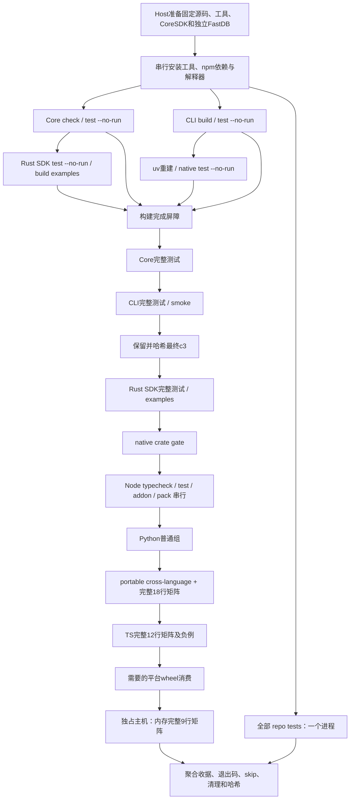

# 大改复核：并行验证资源图与完整门禁

> 后续状态（2026-10-02）：Host 已审核本资源图，授权实现仅编排三组的本机 Python 入口。当前实现、公共 fixture 隔离、纯验证结果及待 Host 执行的命令见 [Python 并行验证实施报告](2026-10-02-python-parallel-validation.md)。以下保留首轮审核证据，“本轮仅新增本文”“待审核”等表述描述首轮，源码引用行号对应固定的 `1c78cd6` 快照。普通组已获准采用 `loadfile -n2`；两个完整矩阵继续串行。历史门禁是否执行的判断不代替 Host 后续提供的 867/904 零 skip 运行记录。

日期：2026-10-02。结论：可以先并行独立目标的构建和仓库工具验证；同一主机、同一 checkout 的 IPC/relay 行为测试先限制为一个顶层任务。严格矩阵保持整模块、单进程、默认顺序。需要更多行为测试并行时，由 Host 提供完整隔离环境，不能只加 `pytest -n auto` 或改 Cargo target。

本文是待 Host 审核的执行设计，不是新的通过收据，也不是整个生产改动的最终无缺陷结论。本轮仅新增本文，没有改代码、测试、CI、原始 checkout 或全局设置，没有 push、PR、merge、release，也没有重复运行已知不能 `shm_open` 的沙箱套件。

## 1. 比较范围、规范与证据边界

固定审查命令：

```sh
git diff 8777e2dd157942fe6f3cc90389763af35f5056bd...1c78cd6e5fc49cd97126ec6f5707757cdaf99d6a
git log 8777e2dd157942fe6f3cc90389763af35f5056bd..1c78cd6e5fc49cd97126ec6f5707757cdaf99d6a --oneline
```

实际 HEAD 为后者，初始工作树干净；固定 diff 涉及 97 个文件。规范为 [AGENTS.md](../../AGENTS.md:31) 和 [CONTRIBUTING.md](../../CONTRIBUTING.md:30)，意图为 [批准的计划](../plans/2026-09-26-memory-policy.md:28) 和 [预算契约](memory-budget-contract.md:5)。AGENTS 的 0.x 清理规则允许移除错误内部机制，但不能据此隐藏公开 API、默认值、错误及生命周期变化。

已逐项读取入口与依赖：根/Python pyproject、Core workspace、Rust SDK、CLI、Python native manifests，Python fixture 与矩阵，Node package/build scripts，Windows runner，以及 CI、Windows Native、Release Candidate 三个 workflow。分析分别核对规范/资源与意图/测试改写；没有派 Buddy peer，静态结论没有充当运行证据。

[历史验收](memory-native-final-validation.md:3) 绑定实现 `abfeaf71deaa9ff4428d0c043ab80e3210746f47` 与 FastDB `4f99f86a662b0e950a0dd29800c25a1c9fca4def`。本轮检查 `abfeaf7...1c78cd6` 仅六个文档文件变化，生产与测试代码相同。因此历史记录有相关性，但本轮未下载、独立核验 hosted 原始日志，也未重跑行为测试；历史成功不证明拟议并行图没有竞争。

## 2. 实际入口与本来已有的并行

| 入口 | 实际覆盖与先决条件 | 不包含的内容 |
| --- | --- | --- |
| `cargo test --manifest-path core/Cargo.toml --workspace` | 13 个 member 的默认测试目标、integration 与 doctest；CoreSDK system link；FastDB sibling golden/TS 源；Node/tsc | CLI、Rust SDK、Python native；独立 Node package 测试 |
| `cargo test --manifest-path sdk/rust/Cargo.toml --all-features` | SDK 公共 API、payload lifetime、compile-fail 等；system link | 两个 example 的实际运行 |
| `cargo test --manifest-path cli/Cargo.toml` | CLI unit + 四个 integration 文件；Git patch/source link | 安装器全部平台行为、候选包消费 |
| `cargo test --manifest-path sdk/python/native/Cargo.toml` | native crate 测试/编译入口；source link，正确 `PYO3_PYTHON` | Python 层行为；目前该源码未发现 Rust test 函数，不能以此成功代替 Python 套件 |
| `uv run --no-sync pytest sdk/python/tests` | 36 个 unit 文件、27 个 integration 文件；native 重建、c3、FastDB、示例依赖、TS 工具 | `tests/repo` 的 19 个文件、Node package 独立 gate |
| `pytest tests/repo` | 仓库工具、收据验证器、安装器、工作流与 runner 的测试 | 实际完整包消费/矩阵执行；很多测试使用模拟输入 |
| Node package scripts | tsc、原生 addon、三个 `.test.mjs`、tarball 包检查 | Python/TS 真实调用矩阵、浏览器运行时 |
| `tools/ci/windows_native.py --scope full` | 当前 23 gate；单脚本顺序运行，保留每步证据 | 全部 repo tests、Rust examples 显式运行、所有 Release Candidate 平台 |
| `--scope local-platform` | 八个 crate 的 `--lib --no-fail-fast` | 完整 Core integration/doctest、codegen、Core runtime、SDK/CLI 等 |

依据：[Core members](../../core/Cargo.toml:3)、[四个独立 manifest](../../sdk/rust/Cargo.toml:1)、[Python testpaths](../../pyproject.toml:50)、[native features](../../sdk/python/native/Cargo.toml:13)、[Windows gates](../../tools/ci/windows_native.py:305)。`cargo check --workspace --all-targets` 是编译门禁，不能算测试运行。

Rust 已有 libtest 函数级并行；Cargo 的编译 `-j` 与测试 `--test-threads` 是两种限额。IPC 测试还自行启动两线程 Tokio runtime（[tests.rs](../../core/transport/c2-ipc/src/tests.rs:2775)），[SyncClient](../../core/transport/c2-ipc/src/sync_client.rs:106) 自有两线程 runtime，Python 测试内部也启动 4/6 个线程。限制顶层进程数并不会限制这些用于证明并发行为的内部线程。

CI 已经采用独立 runner 并行：

- [ci.yml](../../.github/workflows/ci.yml:58)：`changes` 后 Core、CLI、workflow-policy、Python 3.12、3.14t 可并行，matrix `fail-fast: false`。每个 runner 内步骤仍按顺序执行；不是单主机五个任务共享同一目标目录。
- [windows-native.yml](../../.github/workflows/windows-native.yml:33)：Windows 2022/2025 × local-platform/full 四个独立 job；编译/CMake 已各限制为 2；full runner 内仍逐 gate 串行（[主循环](../../tools/ci/windows_native.py:481)）。
- [release-candidate.yml](../../.github/workflows/release-candidate.yml:49)：scope → context → CLI 五目标、Linux wheel 两目标、FastDB 五目标；CLI 后 native wheel 十八 ABI 行与 sdist；再 smoke 五目标、Linux ABI 十二行、Windows standard-user；最终 manifest 等全部依赖结束。完整启用时是 52 个 job。Linux wheel 每个目标的六解释器由一个 maturin job 构建，native wheel 是独立解释器 job。
- 三 workflow 的 `cancel-in-progress` 是同 ref 的运行替换规则，并非同一运行遇失败即删除其他任务日志；也不是共享资源互斥机制。

不建议第一版按 Core crate 拆 gate。[c2-http](../../core/transport/c2-http/Cargo.toml:9) 的默认 features 为空；完整 workspace 因 [c2-core dev dependency](../../core/runtime/c2-core/Cargo.toml:29) 启用 relay。反例：改成单独 `cargo test -p c2-http`，退出 0 仍可能没有运行原 workspace 的 relay 测试。若未来拆包，须保留完整 feature 闭包、integration、doctest，并比较收集清单；不能用 `--lib` 取代它。

## 3. 跨任务资源与实证反例

| 资源锁 | 事实、反例与锁范围 |
| --- | --- |
| `host-ipc` | [unique_ipc_address](../../sdk/python/tests/conftest.py:31) 只有进程内计数；两个 pytest worker 都能得到 `ipc://test_hello_1`。锁覆盖整套 Python/portable/TS/Node/Rust 行为 gate。独立进程只隔离 registry，不隔离 OS endpoint。 |
| `python-env` | registry、settings、环境变量是进程级状态；[矩阵 reset](../../sdk/python/tests/integration/test_portable_payload_matrix.py:71) 会清理当前 registry。禁止线程化跑不同测试。`uv sync`/重安装持独占锁，消费者只读同一已完成环境，全部 `--no-sync`；禁止两个解释器轮流改同一 venv。 |
| `core-target` | [generated_rust_sdk](../../core/foundation/c2-codegen/tests/generated_rust_sdk.rs:324) 与 [cross-language fixture](../../sdk/python/tests/integration/test_portable_payload_cross_language.py:176) 硬编码 `core/target`；顶层 `CARGO_TARGET_DIR` 不能隔离它们。Core gate、默认矩阵、Node Rust build 全程互斥。Cargo 文件锁能等待编译，不能保障随后执行/哈希的是未被另一任务替换的字节。 |
| `sdk-target` / `cli-target` / `native-target` | 分别保留常规目标位置；[SDK compile-fail](../../sdk/rust/tests/public_api.rs:487) 另用 `sdk/rust/target/compile-fail`。native cargo 与 maturin/uv rebuild 不能同时改同一 native target；CLI test 后才能冻结 c3，之后不得 relink。 |
| `npm-tree` | [pretest/prepack](../../core/foundation/c2-mem-ffi/bindings/typescript/package.json:28) 都 rebuild；[addon build](../../core/foundation/c2-mem-ffi/bindings/typescript/scripts/build-node-addon.mjs:23) 写固定 `dist/native`，Windows 另写 `build/Release`。锁覆盖 `npm ci/test/pack/typecheck/test:node-addon` 整项，不只 Cargo 部分。 |
| `npm-tree` 的污染反例 | [pack-check test](../../core/foundation/c2-mem-ffi/bindings/typescript/tests/c2-mem-ffi-pack-check.test.mjs:12) 在真实 dist 写 `unexpected-debug.map` 后验证拒绝再删除；同时 TS fixture `npm pack` 可能打进此文件。另设 Cargo target 也消除不了污染。 |
| `fastdb-tree` / `emsdk` | [TS prepare](../../sdk/python/tests/integration/test_typescript_real_calls.py:229) 校验 FastDB SHA/clean；随后 build WASM、TS、pack。只能使用 Host 提供的独立 sibling，不能改原始 FastDB。安装/activate emsdk、npm ci 与所有读取它们的 codegen/TS gate 不可重叠。构建完成再只读共享。 |
| 端口 | [普通 relay](../../sdk/python/tests/conftest.py:78) 与 [MatrixRelay](../../sdk/python/tests/fixtures/portable_matrix.py:500) 都先找空闲端口、关闭探针再 bind。普通 fixture 默认重试五次，MatrixRelay 没同等重试；锁只能避免本 runner 的冲突，不能保证其他用户进程不抢端口。遇真实冲突应失败留日志，不增加吞错重试。 |
| 临时目录/SHM | [spill test](../../core/foundation/c2-mem/src/spill.rs:211) 删除固定 `temp_dir()/c2_spill_test`；两份 c2-mem 测试可能删除彼此目录。每个顶层任务独占 `TMPDIR/TMP/TEMP` 与 pytest basetemp。SHM pool PID/UUID incarnation 减少 backing 名冲突，但 IPC 逻辑地址仍会重复。不能全局清理 `/dev/shm`、socket 或临时目录。 |
| 进程内锁 | [relay ENV_LOCK](../../core/runtime/c2-core/tests/client_modes.rs:92) 与 [退休故障注入读写锁](../../core/transport/c2-ipc/src/client.rs:243) 已序列化部分操作；保留整 harness，不绕锁分片。环境锁不是跨进程端口/SHM锁。 |
| 收据 | 每个 run/解释器使用唯一输出目录、receipt 名及 JUnit。禁止多个任务写默认 `target/local-rc`，禁止沿用上次成功收据、跨源码拼行或事后补 passed。 |

在 collection 前已发生外部依赖：[portable_interop.py](../../sdk/python/tests/fixtures/portable_interop.py:22) 导入时读取两个 FastDB golden spec。Host 必须先准备正确 sibling 或将 `C2_PORTABLE_MATRIX_FIXTURE_ROOT` 指向包含 `record-all-types.source.json`、`graph-all-values.source.json` 的已核验目录。这个 env 不能替代 Rust `include_str!` 的固定 sibling 依赖，也不能代替 TS 源码模式的 FastDB checkout。

两个矩阵共享 `MatrixArtifacts.prepare` 的同名 Rust binary。可以分别设 **`C2_PORTABLE_MATRIX_CARGO_TARGET_DIR`**（[实现](../../sdk/python/tests/fixtures/portable_matrix.py:319)），仅设 `CARGO_TARGET_DIR` 会被 fixture 覆盖。第一版仍串行；以后整模块隔离时才用这个 seam。

TS 可以同时提供 `C2_TYPESCRIPT_FASTDB_PACKAGE`、`C2_TYPESCRIPT_C2_MEM_PACKAGE`、`C2_TYPESCRIPT_COMPILER_PACKAGE` 三个 tarball（[校验](../../sdk/python/tests/integration/test_typescript_real_calls.py:209)），减少共享树写入。它仍依赖 golden fixtures、Rust harness、c3 与 native。不得拿历史 candidate tarball 冒充本次源码产物，也不能未经 Host 同意把源码验证改成包消费验证。

## 4. 严格矩阵不可分片

Rust/Python 的 `_MATRIX_ROWS` 在测试行执行后累计，最终 [tuple 精确断言](../../sdk/python/tests/integration/test_portable_payload_matrix.py:329) 要求 18 行及稳定顺序。TS 的 `_ROWS`、`_NEGATIVE_EVIDENCE` 最终 [同时聚合](../../sdk/python/tests/integration/test_typescript_real_calls.py:743) 12 行、digest mismatch 和 opaque allocator 两项负例以及 cleanup。把最终测试放另一进程会没有状态；只跑 row 子集不能得到合格收据。

两模块均保持完整命令，不使用 `-k`、`-x`、`--lf`、随机排序、xdist、逐 row 分片；保留现有 timeout mark、正负断言与结束聚合。portable 的跨语言 proof 模块也完整运行。内存九行 driver 原本逐行运行，每行内部最多四 worker（[row table](../../tools/benchmarks/ipc_memory.py:680)）；`--only` 子集可以退出 0，full gate 仍必须拒绝它（[验证器](../../tools/ci/windows_native.py:149)）。

最终屏障必须重新调用现有 receipt validators，检查 fresh output、精确行集/顺序、路径计数、包与 c3 hash、负例与 cleanup；pytest 总项数不替代它们。

## 5. Host 审核用执行图

### 5.1 首版：单主机、一个 checkout，不修改测试

容量假设为至少 8 个逻辑 CPU、16 GiB RAM、可用 SHM/磁盘足够、native IPC 权限正常。不是性能或所有科学负载保证。小机器下降为一个构建 slot；不得修改测试里的内部并发来满足机器容量。



箭头是顺序/依赖，不代表每个前项的业务失败都阻止后项：CLI/native 构建失败会阻止其消费者；Core 某行为断言失败不应吞掉仍可独立执行的 SDK/Python 结果。runner 应按真实输入依赖判断 `not_run`，同时按互斥锁串行 dispatch。

具体限额：构建最多两个顶层 slot，每项 `CARGO_BUILD_JOBS=2`、`CMAKE_BUILD_PARALLEL_LEVEL=2`；Core/CLI 两目标可并行编译，SDK 编译可与 uv/native 构建并行。同 native 目标的 uv 与 cargo 串行。同 Core 目标的 Node 构建必须等 Core 构建完成。系统/native/source 构建使用各任务 env，绝不同时改变父进程 env。repo tests 可与构建或一个行为组并行，但内存计时矩阵前必须全部结束。

行为任务最多一个顶层 slot，Rust libtest 初始 `--test-threads=4`；pytest 一个进程，不装/启用 xdist。Node `npm test` 保留 Node 原有 file harness 并发，本项目只有三个文件，顶层仍一项。运行线程/进程峰值受测试内部创建影响，限额不是硬总线程上限；记录 CPU/RSS/进程峰值，OOM 或超时为失败，不能调低断言/内部并发。

内存 matrix 独占所有 build/test slot，维持原九行、内部 worker=1/4、不用 `--only`；控制器、行控制器、服务器/worker 进程均记录 PID 与退出。单行 child 120 秒、row 300 秒、整体 3600 秒沿用 Windows gate。不得同时跑 pytest、编译、npm pack 或另一 benchmark。

### 5.2 扩展：Host 提供独立 runner 后才扩大行为并行

每条 lane 必须有完整 C-Two checkout、独立 sibling FastDB/emsdk、独立 venv/npm trees、Cargo targets、临时目录、receipt 目录；Python 不同版本各有一 lane。相同主机上多个文件目录不足以隔离固定 IPC 名称，应使用真正独立 VM/OS namespace；Windows Named Pipe/SID 与 Unix endpoint 的隔离须各自验证，不能笼统声称 Docker 目录隔离即足够。

构建屏障后可并行 **Core lane ∥ CLI lane ∥ Rust SDK lane ∥ Python 3.12 lane ∥ Python 3.14t lane ∥ repo lane**，资源初始总 active lane≤2，每 lane rust test threads=4、build jobs=2；Host 依据机器资源逐步增加。Python lane 内普通/portable/TS仍顺序；Windows local/full 本已在独立 VM 运行。严格矩阵整体可以在隔离 VM 并行，不能拆行。内存 benchmark另用空闲、独占 runner；最终合并只汇总各 gate 状态/哈希，不拼造矩阵状态。

## 6. 可执行命令清单与构建屏障

以下命令交给 Host 执行，不是本轮已运行结果。Host 先创建新的绝对路径 `RUN`，各任务私有 `RUN/tmp/<id>`、JUnit/logs/receipt 目录。所有命令从固定 HEAD checkout 根执行；输出/build 均不得入 Git。工具安装、外部依赖及 Windows 账户操作由 Host 管理。

每项基础 env：先从子进程环境去除继承的 `C2_*`、旧 `CARGO_TARGET_DIR`、旧 `FASTDB_PAYLOAD_*` 与会改变行为的 `PYTEST_ADDOPTS/RUST_TEST_THREADS`，再显式加入任务配置；不改变父进程/全局设置。设 `C2_ENV_FILE=''`、`C2_RELAY_ANCHOR_ADDRESS=''`、`NO_PROXY/no_proxy=127.0.0.1,localhost`、`PYTHONUTF8=1`、构建 jobs=2；私有 `TMPDIR/TMP/TEMP`。uv 环境固定 `UV_PROJECT_ENVIRONMENT=$RUN/venv/sdk-<python>`，后续 `PYO3_PYTHON` 为该 venv 实际 Python 路径。记录所有额外允许 env；`C2_PORTABLE_MATRIX_*`/`C2_TYPESCRIPT_*` 仅在对应 gate 注入。

`SYSTEM` 表示子进程设 `FASTDB_PAYLOAD_LINK_MODE=system`、`FASTDB_PAYLOAD_SYSTEM_LIB_DIR` 为准备脚本验证出的绝对 lib 路径；Linux 配 `LD_LIBRARY_PATH`、macOS 配 `DYLD_LIBRARY_PATH`、Windows 将 lib dir 加子进程 PATH。`SOURCE` 表示 mode=source 且移除 system lib override。不是 shell 可执行命令名。Core/SDK及 pytest 内生成的 registry Rust consumers 用 SYSTEM；CLI/native/uv rebuild 用 SOURCE。不要将 SYSTEM 导出给整个 workflow 后用 uv 自动重建。

准备阶段（串行或按独立安装目录安排，由 Host 提供可用解释器；本轮不安装到全局）：

```sh
uv python install 3.10
python .github/scripts/prepare_fastdb_sdk.py --output "$RUN/fastdb-core-sdk"
npm ci --prefix ../fastdb/ts/fastdb4ts
npm ci --prefix core/foundation/c2-mem-ffi/bindings/typescript
```

准备脚本不加 `--emit-github`，从其 `FASTDB_SDK_PREPARED` 结果读取 lib dir，写任务 env。FastDB sibling 必须固定 `4f99f86a662b0e950a0dd29800c25a1c9fca4def`；预先验证 golden spec、`node_modules/typescript/bin/tsc`、`src/payload/index.ts`。Node 22、Rust stable、Python 3.12/3.14t/3.10、C/CMake、SWIG 及 Emscripten 5.0.2 按现行 workflow 准备；Windows还需 MSVC/Ninja/Git Bash。缺依赖记 infrastructure failure，不让测试以 skip/early return冒充完整通过。

构建屏障清单；表中的同组操作顺序执行，两个不同 group 可按上文资源图并行：

| ID / env | 命令 |
| --- | --- |
| B-core / SYSTEM | `cargo check --locked --manifest-path core/Cargo.toml --workspace --all-targets`；`cargo test --locked --manifest-path core/Cargo.toml --workspace --no-run` |
| B-cli / SOURCE | `cargo build --locked --manifest-path cli/Cargo.toml --bins`；`cargo test --locked --manifest-path cli/Cargo.toml --no-run` |
| B-sdk / SYSTEM | `cargo test --locked --manifest-path sdk/rust/Cargo.toml --all-features --no-run`；`cargo build --locked --manifest-path sdk/rust/Cargo.toml --examples` |
| B-python / SOURCE | `uv sync --locked --python <该lane解释器> --group examples --reinstall-package c-two`；绑定该 venv 的 `PYO3_PYTHON` 后 `cargo test --locked --manifest-path sdk/python/native/Cargo.toml --no-run` |

uv root dev group 默认安装。源码 sibling/TS 工具是 Core 编译或 runtime tests 输入；`--no-run` 不提前构建测试里动态生成的 consumers。它们运行时的 nested build必须仍受 target锁约束。所有预构建和测试保持相同解释器、profile/features/link mode，避免隔离后又触发意外重建。

行为与仓库测试完整清单：

| ID / env / 互斥 | 必须执行的命令；预期观察 |
| --- | --- |
| C / SYSTEM / host-ipc+core-target | `cargo test --locked --manifest-path core/Cargo.toml --workspace --no-fail-fast -- --test-threads=4 --show-output`；所有 lib/integration/doc 目标结束，不能含因缺 Node/TS 的 `skipping ...` 路径 |
| L / SOURCE / host-ipc+cli-target | `cargo test --locked --manifest-path cli/Cargo.toml --no-fail-fast -- --test-threads=4`；再依次 `cli/target/debug/c3 --version`、`cli/target/debug/c3 --help`、`cli/target/debug/c3 relay --help`、`cli/target/debug/c3 registry --help` |
| H / cli-target | L 完成后将最终 c3复制到 `RUN/cli/c3[.exe]` 并记录 SHA-256；普通 fixture仍读常规 cli/target 路径，后续禁止改它；矩阵用保留副本 |
| S / SYSTEM / host-ipc+sdk-target | `cargo test --locked --manifest-path sdk/rust/Cargo.toml --all-features --no-fail-fast -- --test-threads=4`；`cargo run --locked --manifest-path sdk/rust/Cargo.toml --example client`；`cargo run --locked --manifest-path sdk/rust/Cargo.toml --example host`；两 example均自行注册/调用资源并结束，不是两个互等终端 |
| N / SOURCE / host-ipc+native-target | `cargo test --locked --manifest-path sdk/python/native/Cargo.toml --no-fail-fast -- --test-threads=4`；保留实际测试数，包括零测试目标，不夸大行为证据 |
| J / SYSTEM / host-ipc+core-target+npm-tree | `npm run typecheck --prefix core/foundation/c2-mem-ffi/bindings/typescript`；`npm test --prefix core/foundation/c2-mem-ffi/bindings/typescript`；`npm run test:node-addon --prefix core/foundation/c2-mem-ffi/bindings/typescript`；`npm run pack:check --prefix core/foundation/c2-mem-ffi/bindings/typescript`；四命令顺序，后两项虽有重复路径仍保留现行独立入口 |
| Y / SYSTEM / host-ipc+python-env | `uv run --no-sync pytest sdk/python/tests -q --timeout=30 -rs --ignore=sdk/python/tests/integration/test_portable_payload_cross_language.py --ignore=sdk/python/tests/integration/test_portable_payload_matrix.py --ignore=sdk/python/tests/integration/test_typescript_real_calls.py --basetemp="$RUN/pytest/Y" --junitxml="$RUN/Y.xml"` |
| X / SYSTEM / host-ipc+python-env+core-target | `uv run --no-sync pytest sdk/python/tests/integration/test_portable_payload_cross_language.py sdk/python/tests/integration/test_portable_payload_matrix.py -q --timeout=300 -rs --basetemp="$RUN/pytest/X" --junitxml="$RUN/X.xml"`；完整 proof 与 18 行收据 |
| T / SYSTEM / host-ipc+python-env+core-target+npm-tree+fastdb-tree | `uv run --no-sync pytest sdk/python/tests/integration/test_typescript_real_calls.py -q --timeout=600 -rs --basetemp="$RUN/pytest/T" --junitxml="$RUN/T.xml"`；12 行、两个负例、lazy backing实调用与 cleanup全部通过 |
| R / 工具环境 / 私有tmp | `uv run --no-project --with pytest --with pytest-timeout --with packaging --with pyyaml --with maturin pytest --confcutdir=tests/repo tests/repo -q --timeout=30 -rs -p no:cacheprovider --basetemp="$RUN/pytest/R" --junitxml="$RUN/R.xml"`；全部19文件，不沿用CI的子集 |
| P310 / 与Y同env/串行 | `uv run --no-sync pytest sdk/python/tests/unit/test_python_examples_syntax.py::test_python_examples_compile_on_minimum_supported_python -q --timeout=30 -rs --junitxml="$RUN/P310.xml"`；明确为执行而非 skip；它是重申Y中的最小版本门禁 |
| M / SYSTEM / 独占主机 | `uv run --no-sync python tools/benchmarks/ipc_memory.py --mode matrix --output-dir "$RUN/ipc-memory-matrix" --memory-stats --require-memory-stats --child-timeout 120 --row-timeout 300`；9行完整、同native hash、正常退出、required stats、不把强制终止计为成功 |

Windows 命令用对应 `.exe` 与 PowerShell/argv环境实现，不照抄 POSIX loader变量。表中 Y 的三个 `--ignore` 是精确迁移到 X/T，最终 Y∪X∪T 等于全 `sdk/python/tests`，无剩余排除。Host 实现时保存 collection nodeid 清单并校验集合相等；基线与并行版本使用相同分组，不能把缺失项当提速。

X 设置 `C2_PORTABLE_MATRIX_RECEIPT=$RUN/portable.v1.json`、`C2_PORTABLE_MATRIX_EVIDENCE_STAGE=development`、`C2_PORTABLE_MATRIX_C3_BIN=$RUN/cli/c3[.exe]`。T 设置其独立 `C2_TYPESCRIPT_RECEIPT=$RUN/typescript.v1.json`、`C2_TYPESCRIPT_EVIDENCE_STAGE=development`、`C2_TYPESCRIPT_FASTDB_SOURCE_SHA` 为固定 FastDB SHA，以及相同 c3输入。不要设置虚假的 package SHA或用 candidate stage代替development。

最终收据屏障使用现行验证器（M的python命令还必须成功）：

```sh
uv run --no-sync python - "$RUN" <<'PY'
from pathlib import Path
import sys
from tools.local_rc.portable_matrix_receipt import load_and_validate_receipt as portable
from tools.local_rc.typescript_receipt import load_and_validate_receipt as typescript
from tools.ci.windows_native import matrix_evidence_problem
root = Path(sys.argv[1])
portable(root / 'portable.v1.json', expected_stage='development')
typescript(root / 'typescript.v1.json', expected_stage='development')
problem = matrix_evidence_problem(root / 'ipc-memory-matrix')
if problem is not None:
    raise SystemExit(problem)
print('18/12/9 strict receipt validation passed')
PY
```

除了结构验证，runner还须检查收据本次创建、source/native/c3 hash与其冻结输入一致、原始 gate退出0；不能仅验证某个文件存在。

### 6.1 平台与包消费门禁，不用本机成功代替

Windows保持现行命令，在两个原生 runner分别完整运行；不要同时在一 checkout运行两个 scope：

```sh
python tools/ci/windows_native.py --expected-c-two-sha 1c78cd6e5fc49cd97126ec6f5707757cdaf99d6a --expected-fastdb-sha 4f99f86a662b0e950a0dd29800c25a1c9fca4def --fastdb-system-lib-dir <已验证绝对lib目录> --scope local-platform --output <本次独占目录>
python tools/ci/windows_native.py --expected-c-two-sha 1c78cd6e5fc49cd97126ec6f5707757cdaf99d6a --expected-fastdb-sha 4f99f86a662b0e950a0dd29800c25a1c9fca4def --fastdb-system-lib-dir <已验证绝对lib目录> --scope full --output <另一独占目录>
```

当前 full gate 完整名单为：python310-install、fastdb-npm-install、c2-mem-npm-install、c2-mem-node-tests、c2-mem-node-package、fastdb-rust-test、core-check、core-test、cli-build、cli-test、cli-artifact、rust-sdk-test、python-native-test、fastdb-wheel-build、python-wheel-build、windows-wheel-consumer、windows-standard-user-consumer、python-build、windows-harness-tests、ipc-memory-matrix、python-tests、portable-tests、typescript-tests。静态调用 `gates()` 已核对为23项；不能将脚本现有dependency字段直接视为安全并行图，它还依赖列表顺序和隐含资源锁。

补充入口：FastDB自身 `cargo test --locked --manifest-path ../fastdb/bindings/rust/Cargo.toml --workspace --all-features`；`uv build --wheel --python <解释器> --out-dir <唯一目录> --no-create-gitignore ../fastdb` 与 `... sdk/python`；随后 `python tools/ci/windows_wheel_smoke.py --fastdb-wheel <目录/文件> --c-two-wheel <目录/文件> --c3 <冻结c3> --receipt <唯一json>`，Windows standard-user由 Host依 [wrapper](../../tools/ci/windows_standard_user.ps1:1) 在独立 runner执行。以上需要外部源码/权限，不属于本轮可执行范围。

Release Candidate的五目标、六ABI、sdist检查/从解包内容构建/无SDK环境import/installed lifecycle、普通smoke、Windows非管理员与最终精确manifest仍须保持现行工作流，不由上面的源码测试替代；依赖见第2节。官方hosted job的实际指令以 [workflow](../../.github/workflows/release-candidate.yml:269) 为准，本轮不触发该workflow或发布操作。

本地历史候选流程也是独立入口：`uv run --no-sync python -m tools.local_rc.build_candidate --output <新目录> --fastdb-candidate <Host固定候选目录> --python-current <绝对解释器> --python-310 <绝对解释器>` → `uv run --no-sync python -m tools.local_rc.package_consumers --candidate <该目录> --receipt <新json>`。它依赖自己的全套包输入；[历史42件/4消费者](../../AGENTS.md:96) 是历史证明，不能凭本轮核心测试自动重记为通过。未来需要这类验收时单独分配包构建资源和审批，当前不实现。

## 7. 旧“全套”遗漏、filter 与 skip 的准确表述

能证明的是入口排除/条件跳过，不能在没有原始日志时断言“历史上绝对从未运行”。

| 情形 | 实际边界与补救 |
| --- | --- |
| 根默认pytest或 `pytest sdk/python/tests` | 完全不收集19个repo文件；旧基线已有18个。加完整R，而非仅增加一个benchmark文件。 |
| 当前CI workflow-policy | [显式选择](../../.github/workflows/ci.yml:158) 13个repo模块（check_version指定class）；不含 test_local_registry、test_local_candidate_manifest、test_package_consumers、test_portable_matrix_receipt、test_typescript_receipt、test_windows_wheel_smoke六文件。旧CI还没有新增benchmark gate；不能称其覆盖全部仓库工具。 |
| 普通LinuxCI | 没有独立 Rust SDK、Node package test/pack、内存九行、Windows本地权限或非管理员gate；Python内嵌proof/TS验证并不能代替所有独立入口。 |
| Windows local-platform | `--lib` + 八crate，不是Core workspace全套。full包含另分出的portable/TS，因此ordinary Python的三个ignore本身不等于削弱。 |
| 缺c3 | [conftest](../../sdk/python/tests/conftest.py:84) 会skip relay；先build常规路径binary，不需要全局link。 |
| 缺Python3.10/示例依赖/FastDB | [syntax](../../sdk/python/tests/unit/test_python_examples_syntax.py:80)、[example imports](../../sdk/python/tests/integration/test_python_examples.py:83)、[grid](../../sdk/python/tests/integration/test_grid_python_smoke.py:25)、[infer](../../sdk/python/tests/unit/test_contract_infer.py:106)、[stats facade](../../sdk/python/tests/unit/test_memory_stats_facade.py:473) 能skip。安装输入并记录 `-rs` 和JUnit；不是删除这些skip分支。 |
| Core codegen缺工具 | [generated_targets](../../core/foundation/c2-codegen/tests/generated_targets.rs:262) 和 [:328](../../core/foundation/c2-codegen/tests/generated_targets.rs:328) 直接输出skipping后return，libtest会计为passed，甚至失败捕获前置检查不够时日志可能不显示。先检查依赖存在且可运行；对这两个目标保留 `--show-output` 或独立完整目标日志，审核具体测试确实进入验证路径。 |
| Repo平台/外部fixture | [PowerShell installer](../../tests/repo/test_install_c3_powershell.py:19) 缺pwsh跳过、Windows拒绝Unix假PE fixture；[wheel wrapper](../../tests/repo/test_windows_wheel_smoke.py:124) 缺pwsh跳过。Unix装pwsh + Windows真实消费两环境覆盖，不伪装平台。 |
| Repo真实CoreSDK fixture | [prepare_fastdb tests](../../tests/repo/test_prepare_fastdb_sdk.py:159) 两项依赖硬编码 `/tmp/fastdb-021-main-candidate/release`，不存在会skip。Host须提供准确fixture或将缺口单列；不能用模拟tarball测试说已运行真实release输入。该路径的准备不在本轮权限内。 |
| Filtered matrix/历史receipt | `-k`或内存`--only`不能形成18/12/9全量证据；独立收据validator测试是测试validator，不是执行实际矩阵。 |

[历史记录](memory-native-final-validation.md:24) 明确两套Windows full的Python/harness/portable/TS为零skip；本文没有否定这条记录。但它不覆盖上述六个repo模块，不能证明公开字段迁移没有影响，也不能证明所有平台/新并行调度。Windows11、逐处复制字节归因和吞吐改善仍明确未验证（[边界](memory-native-final-validation.md:47)）。

## 8. 测试改写与公开行为复核：已核对事实和未完成项

### 规范轴

- 没有因源码行大量删除就判定覆盖下降。Core pool的旧handle测试移动至 [handle_tests](../../core/foundation/c2-mem/src/pool.rs:2812)，server旧chunk GC仍在 [server.rs](../../core/transport/c2-server/src/server.rs:8142)；Python统计用例仍验证释放和后续512KiB可分配（[test_mem_pool](../../sdk/python/tests/unit/test_mem_pool.py:479)）。
- 真实公开迁移必须披露：`c_two.mem.__all__` 导出PoolStats（[位置](../../sdk/python/src/c_two/mem/__init__.py:97)），`total_bytes/free_bytes/fragmentation_ratio` 被新buddy统计替代（[native 字段](../../sdk/python/native/src/mem_ffi.rs:194)）。反例：旧用户 `pool.stats().free_bytes` 现在抛AttributeError；改测试字段不能证明旧用户代码仍兼容。现有[技术报告](memory-pressure-observability.md:25)已有说明，但迁移验收应列作可见变化。
- 已有阶段报告不一致：[memory-backing-budget.md](memory-backing-budget.md:71) 仍说generation耗尽保留原abort/error；最终 [pool.rs](../../core/foundation/c2-mem/src/pool.rs:2264) 和 [phase1](memory-policy-phase1.md:25) 是dedicated fallback。这是文档事实冲突，不应将两阶段报告拼成同一最终契约；本轮不获准修改旧报告。

### 意图轴

- 批准意图明确默认lazy、retire-to-zero、buddy关闭仍保留其他层，预算8/16/8GiB有限且zero非unlimited（[契约](memory-budget-contract.md:18)）；原大负载可能现在容量失败，首次失败connect也冻结配置，shutdown不强制释放held。是需要验证/披露的真实行为变化，不能以0.x免除检查。
- 已检查chunk字节、乱序、末块裁剪、重复拒绝、held错误、GC容量等旧断言迁移；未发现这些已核对路径被整体取消。旧should_spill测试由确定性pressure测试覆盖0/1阈值和实际新增backing成本（[pressure](../../core/foundation/c2-mem/src/pressure.rs:253)）。这不是对全部27k新增行的最终正确性担保。
- Core `ChunkAssembler::new`/`finish` 所有权接口改变为共享pool与ReassemblyBacking，裸拆owner API清理需列入Core公开接口迁移（[assembler](../../core/protocol/c2-wire/src/assembler.rs:57)）。Python `write_at` 越界错误从固定文本变为详细carrier错误、增加溢出检查（[native](../../sdk/python/native/src/mem_ffi.rs:630)）；generation耗尽从直接错误变dedicated成功也是真实错误/回退行为变化。
- **纠正一个容易误判的点**：固定基线的MemHandle成功release后len本来就抛RuntimeError、repr为released、is_*为false；当前新增 [released-state测试](../../sdk/python/tests/unit/test_chunk_assembler.py:261) 保护旧行为，并非从len=0改成异常。不能拿中间实现报告代替固定diff。
- **覆盖待核对**：该新测试docstring称失败release保留carrier可重试，但实际只跑成功release。当前 [实现](../../sdk/python/native/src/mem_ffi.rs:656) 静态支持成功后才take；这个Python用例不能证明释放失败后的重试。Host应核对Core失败路径证据，并在后续获授权的测试工作中提供可注入失败的反例。当前不改现有测试。

两轴没有给出“整改可合并”的结论。完整生产审查、旧行为与新门禁运行结果的逐项对应仍需要Host后续验收；本轮先解决并行验证方式，避免诊断前调整门禁。

## 9. 最小runner设计、失败与计时

暂不实现runner。Host审查通过后，最小实现只需要任务DAG、资源锁与记录器，不引入测试分片/新skip：

1. 每任务记录固定argv、cwd、输入SHA/hash、env差异、dependencies、lock集合、CPU slot、timeout、expected outputs。准备阶段核验工具；输出路径必须全新，旧文件存在即拒绝。
2. scheduler最多两个build slot、一个行为slot；资源锁按稳定顺序获取。`host-ipc`跨任务独占；benchmark要求所有slot空闲。一个中央记录器原子写run manifest，不能并行改同一个 `.tmp` 文件。
3. stdout/stderr直接写该gate二进制日志，保留完整内容；同时保存开始/结束UTC、monotonic运行时长、排队等锁时间、PID、原始exit code/signal、timeout/cancel原因、JUnit及子进程/cleanup状态。console只输出摘要。
4. 保留单项非零退出码，禁止shell pipeline吞掉exit或 `|| true`。runner聚合exit=1用于任一失败/timeout/取消/缺证据；exit=0需要所有适用任务与收据通过。命令不能启动时exit_code=null并保存OSError，不能伪造1或0替代原始状态。
5. 默认失败后继续独立gate，阻断真正依赖它的任务并记not_run；不取消仍能给诊断证据的无关组。明确用户取消/全局时限时，先向owned进程组发温和信号，给fixture有界清理机会，再强杀owned树并排空日志。Windows用Job Object或等效owned tree管理，不能仅杀父PID。不根据全局进程名清理、不删除未知SHM。
6. 超时/强杀必须标cleanup未证实，保留目录、进程/SHM清单差异及日志，终止后须确认无仍占锁的owned子进程才派下一组。fixture已有临时relay日志可能随关闭销毁，第一版runner不能声称捕获了所有这些内部日志；只能保留父输出/已有receipt，缺失点列明，未来经授权才增加诊断输出。
7. 最终独立核对collection清单无遗漏、JUnit failures/errors/skips、Cargo所有目标结尾、完整收据/负例、source/native/c3 hash、正常退出和清理。平台不适用项单列并以另一真实环境覆盖，不能把skip算passed。

计时分为准备/安装、冷build、热build、纯测试执行、等待资源与总makespan。串行基线与并行版用同源码对、解释器、CPU/内存、构建jobs、Rust harness线程数、分组、env、cache状态及依赖；各至少三次，保存每次原始时长与范围/中位数。若缓存不同、某项skip/not_run/失败，不能报告同等覆盖的提速百分比。Rust内部libtest线程调整的影响另测，不能与顶层调度收益混算。

内存矩阵固定内部worker数，在同一空闲主机重复；记录首次/稳态latency、吞吐、budget峰值、OS RSS，RSS不是共享backing总和，也不是复制量。不要将测量噪声当内存策略回归，不因负载导致超时就放宽门禁。保存失败第一次结果；诊断重跑追加新attempt，不覆盖或用重试成功删除失败。

## 10. 本轮实际验证与Host下一步

本轮执行的是只读diff/入口分析和标准库pure验证：AST解析当前82个Python测试文件、核对Core13成员；导入纯Windows gate与内存row表，确认23个full gate、local单gate、9行及worker=1/4；两个现行receipt validator均拒绝空收据；读取历史metadata格式；核对固定基线MemHandle行为与abfe→head纯文档差异。报告71处文件引用均存在且行号未越界。没有运行pytest/Cargo行为测试、构建或Node tests。当前checkout无venv，系统Python也没有pytest/maturin；未因此借用旧环境或写全局安装。

Host现在需要审核：第5节单主机保守锁与两个build slot是否符合实际机器资源；是否提供独立VM以扩大并行；第6/7节外部FastDB/CoreSDK/PowerShell/真实release fixtures和平台输入由谁准备。批准资源图后再安排runner实现与重测试。验收要求为完整命令清单无遗漏、fresh 18/12/9收据、原始退出/失败/取消日志、无未经解释的skip/early-return及清理证据；不能只反馈一个“全套通过”总数。

本文完成后已达到用户约定的Host审查节点，本轮停在报告，不推进PR或门禁改动。
