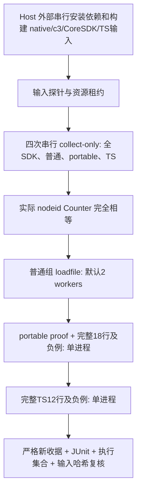

# Python 并行入口：实现、验证与 Host 验收

日期：2026-10-02。基于 `1c78cd6e5fc49cd97126ec6f5707757cdaf99d6a` 的测试基础设施实现；生产修复仍由 Host 在其他树整合。入口是 [tools/dev/test_python.py](../../tools/dev/test_python.py:1)，只编排普通 SDK Python、portable proof＋完整 18 行矩阵、完整 TS 12 行矩阵。新增行为单测及公共 fixture 隔离，没有修改生产 endpoint、测试断言、默认 pytest addopts、现有 CI 或 Windows runner。没有 push、PR、merge、release、peer 调度或全局设置变更。

Host 提供的前置证据是：10 核、约 89GiB 可用磁盘；固定 FastDB `4f99f86a662b0e950a0dd29800c25a1c9fca4def`＋CoreSDK，独立 venv/c3；baseline 867、head 904 个 Python 执行 nodeid 均零 skip，旧 867 全部保留。这是 Host 陈述，本轮没有重新验证这些日志，也没有把它当作新 runner 的通过记录。此前完整门禁与固定 diff 的分析保留在 [资源图报告](2026-10-02-parallel-validation-plan.md:1)；这里承接已批准的窄实现，不重写全平台执行图。

## 执行顺序与限额



普通测试正常失败时仍运行后两组，保留全部失败证据；收集失败/skip、集合不等、取消、超时或残留风险停止后续执行。三个执行组不同时运行，不跨行分片。

| 资源 | 实际约束 |
| --- | --- |
| pytest | `--workers` 只接受 1/2/4，默认 2；1 是 `-n0`。仅普通组采用 `--dist=loadfile`；全部收集及矩阵是 `-n0 --dist=no`。`--max-worker-restart=0`，崩溃 worker 不无限重启。 |
| 超时 | 普通每项 30 秒、portable 300 秒、TS 600 秒；每收集/执行组 wall timeout 默认 3600 秒，可显式设置到 14400 秒以内有限值。 |
| 额外线程/编译 | 子进程环境设置 Cargo/CMake 构建并行度 2，OMP/OpenBLAS/MKL/NumExpr 各 1；这些不是全局配置。测试原有显式线程/进程仍运行，不能宣称整个机器只有两个线程。 |
| native runtime | 保留真实默认和测试显式配置。[server runtime](../../core/transport/c2-server/src/runtime.rs:10) 每实例 2 个 async worker，blocking 上限来自 IPC 配置；[默认解析](../../core/foundation/c2-config/src/ipc.rs:584) 为可用核数截断到 4–64，10 核主机通常为 10。不能用环境覆盖它来让默认配置断言失真。 |
| 可写资源 | Unix 非阻塞租约锁住 checkout、选定 venv、`core/target`、C2 npm source 树、FastDB sibling；另一个本入口使用相同资源立即失败。租约不能约束不遵守它的外部 uv/Cargo/npm 命令，Host 必须排除这些写任务。 |
| 输出 | `--output` 必须是全新目录，所有 collection、JUnit、日志和两份收据写入本目录；既有成功目录禁止复用。 |

分发依据官方 [distribution](https://pytest-xdist.readthedocs.io/en/stable/distribution.html)：`loadfile` 将同文件用例交给同一 worker，保留文件内调度顺序；这适合文件级状态和固定名字。worker/run 标识依据官方 [how-to](https://pytest-xdist.readthedocs.io/en/stable/how-to.html) 的 `PYTEST_XDIST_WORKER`、`PYTEST_XDIST_TESTRUNUID`；session fixture 会在各 worker 各执行，不能当作跨进程互斥。入口不支持 `auto`、`-k`、`-m`、nodeid 过滤参数；拒绝继承 pytest addopts/plugins/autoload 禁用，以及非空配置 addopts。

## 普通测试共享端点审核

已逐项核对普通测试的实际 listener/注册路径，而非只搜索名称。以下是可证明的隔离或竞争边界；静态核对不能替代 Host 的两 worker 真 I/O 运行。

| 对象 | 事实、反例与处理 |
| --- | --- |
| 公共 IPC 地址 | 原 `ipc://test_hello_1` 由每进程独立计数器生成，两个 worker 都可得到同一个真实 endpoint。现在 [公共 fixture](../../sdk/python/tests/conftest.py:36) 拼接固定长度 run 哈希、worker、PID、递增序号。直接串行调用也生成本次命名空间；没有改变 Core 的地址派生规则。 |
| 普通 relay TCP | [free_tcp_port](../../sdk/python/tests/conftest.py:155) bind(0) 后关闭，存在选端口至真实 bind 的窗口。反例：A/B 选择同一个 P，A 先启动，B 在自己的 bind 失败前观察到 A 的 health，可能误认 B ready。新增 [跨进程锁](../../sdk/python/tests/conftest.py:96) 覆盖 [选端口→Popen→readiness](../../sdk/python/tests/conftest.py:321)，ready 后解锁，因此运行中的两个 relay 仍并行。不是只给选端口加线程锁。 |
| 固定 IPC 名称 | [error_test_N](../../sdk/python/tests/integration/test_error_propagation.py:58) 只在这个文件真实 bind；loadfile 不分开该文件。[unit-server](../../sdk/python/tests/unit/test_ipc_config.py:637) 在 ipc_config 真注册，而 runtime_session 的 ensure_server 只创建 [身份投影](../../core/runtime/c2-core/src/session.rs:207)，其他地址验证为 mock/解析/错误目标，不是第二个真实 listener。[runtime_session 的两个固定 listener](../../sdk/python/tests/unit/test_runtime_session.py:679) 仍在同文件。没有因此改生产 endpoint 或放松断言。 |
| 其他 IPC 工厂 | [server](../../sdk/python/tests/integration/test_server.py:33)、[dynamic_pool](../../sdk/python/tests/integration/test_dynamic_pool.py:66)、[heartbeat](../../sdk/python/tests/integration/test_heartbeat.py:32)、[concurrency_safety](../../sdk/python/tests/integration/test_concurrency_safety.py:72) 含 PID；另有 UUID 工厂及 native 自动身份。普通源码未发现绕过公共 relay fixture 的第二类真实 TCP listener；固定 HTTP URL 的其他出现是 mock/配置/失败目标。 |
| registry/环境/SHM | Python 单例、monkeypatch 环境与模块状态在各 worker 隔离，同文件仍串行。MemPool owner 由 [PID/UUID incarnation](../../core/foundation/c2-mem/src/pool.rs:120) 区分，spill 文件含 [PID＋atomic序号](../../core/foundation/c2-mem/src/spill.rs:155)。未增加跨任务通用清扫 SHM 的逻辑；正常释放由原 fixture 负责。 |
| Cargo/uv/npm | 普通用例没有发现需要并发 Cargo/npm 构建的路径；矩阵既有 fixture 会编译动态 Rust harness、生成 Node 工作目录，源码 TS 模式还会串行 npm build/pack。shared `core/target` 与 npm source/dist 仍必须独占，不能另开构建任务。外部预建 WASM，缺少则探针失败。 |
| 模块累积收据 | portable 的 `_MATRIX_ROWS` 与 TS 的 `_ROWS`/负例累积必须留在各自完整单进程；最终现有严格 validator 继续要求精确 18/12 行。新增 [controller配置 guard及收集二次保护](../../sdk/python/tests/conftest.py:62) 对直接 xdist 跑这些文件报错并指向入口或 `-n0`，不删项、不生成部分收据。 |

锁只消除遵守本 fixture 的 worker 之间的选端口竞争。其他用户进程仍可能抢端口，原真实启动/超时断言及最多五次启动尝试保留；失败不能被转为 skip。静态审核没有找到需要扩大到其他测试文件的实际冲突。如 Host 发现一例，应先保留两份日志和 endpoint 身份，确认最窄边界再修改。

## 必要输入与记录契约

[preflight](../../tools/dev/test_python.py:236) 用选定解释器导入 native、FastDB Payload、全部现有可选测试依赖及 pytest 插件；要求 `fastdb4py==0.2.1`，Python 包源码属于本 checkout 的 editable 安装。检查预建 c3、Python3.10、git 元数据、golden 输入、Cargo、Node22/npm、CoreSDK system link 和实际共享库文件；TS 三 tarball 必须全部提供，或使用固定且干净的 FastDB sibling＋预建 WASM＋两个 source tree 的 TypeScript 工具。缺输入时不开始收集，更不允许隐式 skip。fixture 根路径归一化为绝对路径，解释器保留 venv symlink 路径，不通过 resolve 改成全局 Python。

探针记录解释器、native、c3、CoreSDK、golden、tarball、工具版本、tracked diff 及入口/fixture/依赖哈希；运行末尾复核关键输入未变。它不能证明二进制确实由当前 Rust 源码及正确 CoreSDK 构建，Host 必须同时保留外部构建来源和日志。只记录 HEAD 不足以证明 dirty checkout 或二进制来源。

[集合校验](../../tools/dev/test_python.py:58) 比较实际收集的 Counter：普通∪portable∪TS 必须与全 SDK 完全相等，且无重复、无空组。全 SDK 目录意味着以后新增测试会自动进入普通组，除非它属于这三个既有特殊文件。运行时 [各 worker 收集与报告校验](../../tools/dev/test_python.py:193) 还要求每个 worker 的完整收集序列等于计划，每个计划 nodeid 实际 call 一次、所有 setup/call/teardown passed，无收集 skip/错误、无实际 skip/xfail/XPASS；有 JUnit 且 pytest exit 为零。任何对计划外用例的执行或遗漏均失败。

每组 `output.log` 合并 stdout/stderr；公共 relay 的 [独立 stdout/stderr](../../sdk/python/tests/conftest.py:246) 留在 `relay-logs/`，包含 worker/PID及对应测试标识，fixture关闭文件后仍可审阅。`step.json` 保留真实 argv、原始退出码、wall 时间、pid、状态及清理确认；执行校验后同步更新单项记录。`run.json` 保留全流程状态、输入、步骤与总 wall 时间，`plan.json` 保留完整四组 nodeids，workers 写独立收集 JSON，controller 写全部 test phase 报告。两份全新收据由 [既有严格 validator](../../tools/dev/test_python.py:303) 校验，并绑定选定 c3 哈希。

正常失败的原始 pytest exit 不被最后一个成功组覆盖；总退出 1。父 pytest 退出但进程组仍存活会标失败并发信号清理。取消/负信号退出保留 cancelled，顶层退出 130；wall timeout 标 timed_out，顶层失败。入口以新 POSIX session 启动每组，清理按 SIGINT、有界等待、SIGKILL；不宣称强制清理后生命周期断言已经通过，也不会继续后续组。SIGKILL 杀掉入口本身或机器崩溃不能保证最终 JSON 完整，已落盘中间记录必须按未完成处理；独立 SHM 名称不是清理成功证据。

## Host 可直接执行的验证

先在整合后的独立 checkout 外部串行准备/build；安装本次锁定 dev 依赖，不与任何验证同时写 venv/target/npm tree。沿用已固定的 CoreSDK link 环境与构建来源。下面的三个变量均为任务变量，请填写 Host 的已有绝对路径；不要复用其他任务正在写的环境。

```sh
test_python=/absolute/isolated-venv/bin/python
test_c3=/absolute/prebuilt/c3
test_evidence=/absolute/checkout/target/python-parallel-validation

# 无 native/IPC 的入口及严格validator验证
"$test_python" -m pytest tests/repo/test_python_test_runner.py \
  tests/repo/test_portable_matrix_receipt.py tests/repo/test_typescript_receipt.py -q

# 相同源码、相同依赖/二进制、相同预热状态；逐次运行，目录必须不存在
"$test_python" tools/dev/test_python.py --python "$test_python" \
  --c3 "$test_c3" --workers 1 --output "$test_evidence/serial"
"$test_python" tools/dev/test_python.py --python "$test_python" \
  --c3 "$test_c3" --workers 2 --output "$test_evidence/two-workers"
```

如果 Host 已准备三份 Node tarball，以上两条入口命令均追加同一组绝对路径：

```sh
--fastdb-package /absolute/fastdb4ts.tgz \
--c2-mem-package /absolute/c2-mem-ffi.tgz \
--typescript-package /absolute/typescript.tgz
```

不要通过 `uv run` 隐式 sync 启动计时。所有现有 SDK Python 用例均由上述入口覆盖，repo 工具/Rust/npm 本身的完整门禁仍依首轮报告分别执行，此入口不声称替代它们。源码 TS fixture 的动态 npm/Rust 构建属于既有测试的工作，仍是矩阵 wall 时间的一部分。

比较两次 `plan.json` 的 full nodeid Counter，并与 Host 旧 867 执行清单核对包含关系；对每组 JUnit/phase reports 确认零失败、零 skip、无缺失/重复 call；两次 strict portable 18/18 与 TS 12/12 收据分别独立验证、c3 哈希匹配。生产修复整合后数量可以变，不能把 904 写成永远固定常量。

计时分别报告四次收集总时间、ordinary、portable、TS 及流程总 wall，普通组速度比取 serial ordinary / two-worker ordinary，总时间加速比另列。先用同一源码/编译器/venv/native/c3/Node 包预热两种配置，再交替 1→2、2→1 进行至少三对测量，取中位数，并保留每次新目录。预热日志不能充当正式通过证据；矩阵 Cargo target、临时生成路径及 npm cache 的冷热也应记录，避免将一次编译命中计成 xdist 收益。资源压力与 native 默认线程数保留真实值，workers=4 暂不作为默认候选。

## 本轮可验证证据与待验收项

本轮在 `/tmp` 独立 pure 环境使用 Python3.14.5、pytest9.0.3、pytest-xdist3.8.0、execnet2.1.2、pytest-timeout2.4.0。网络安装受沙箱阻止，因此只读复制已有缓存包到 `/tmp`；没有更改全局 uv cache 或环境。新增 lock 只添加 xdist3.8.0 与其必要 execnet2.1.2，artifact 元数据核对官方 [xdist](https://pypi.org/pypi/pytest-xdist/3.8.0/json) 和 [execnet](https://pypi.org/pypi/execnet/2.1.2/json)，没有升级既有包。`uv lock --offline --check` 已通过。

纯测试不是固定列表的重复断言：构造临时真实 pytest 源码，启动实际两 worker loadfile，参数化 nodeid 和模块内累积 receipt 测试在完整单进程执行；注入遗漏、运行 skip、收集 skip、测试失败、超时、取消、活跃孙进程等反例，检查失败退出/日志和后续组行为。通过 AST 隔离公共 fixture 的 native 导入，执行实际地址/guard/锁函数，并以两个真实 Python 进程验证锁的无交错顺序。收据绑定测试调用实际 runner 函数，严格 schema/精确行集由现有 validator 测试另行覆盖。

最终纯验证数量及命令以本报告末尾更新记录为准。没有运行真实 SDK SHM/IPC、portable Rust/Python 或 TS I/O，也没有声称两 worker 提速、现有功能无回归或三项生产修复已整合。下一节点是 Host 真运行与审阅固定产物：serial/two-workers 的 `run.json`、`plan.json`、三个 JUnit/日志/phase reports、各自两份 strict 收据，以及来源/预热/计时记录。出现真实共享端点冲突时停止提速结论，先提交可复现证据和窄文件边界。

最终更新：新增 runner 测试 26 项、既有 portable receipt 26 项、TS receipt 14 项，共 **66 passed，19.48 秒，exit 0**。命令如下，JUnit 留在 `/tmp/c2-runner-final-tests.xml`，属于沙箱临时验证证据，不是 Host 的 SDK 真 I/O 收据：

```sh
PYTHONDONTWRITEBYTECODE=1 /tmp/c2-runner-pure-venv/bin/python -m pytest \
  tests/repo/test_python_test_runner.py tests/repo/test_portable_matrix_receipt.py \
  tests/repo/test_typescript_receipt.py -q -p no:cacheprovider \
  --basetemp=/tmp/c2-runner-final-tests --junitxml=/tmp/c2-runner-final-tests.xml
UV_CACHE_DIR=/tmp/c2-runner-uv-cache uv lock --offline --check
git diff --check
```

另核对所有原 lock package 的完整结构记录（仅从 workspace 的 dev 引用移除新 xdist 后比较），既有记录逐项相等，新增集合仅 xdist/execnet；三份改动 Python 文件通过 `ast.parse(..., feature_version=(3,10))`。真实 pure pytest 测试还确认 controller 提前拒绝直接并行矩阵，报错包含单进程引导且不会开始写部分收据；普通两 worker 的三个显式 ignore 正常通过这个 guard。

## Host 实际运行与验收（2026-10-02）

Host 阅读入口、fixture、锁和退出码处理的全部差异后，在相同源码、依赖和新构建 native/c3 上按 workers=1、2 各执行一次完整入口。源码逐文件 SHA-256 位于 `/tmp/c2-full-review-1002/integrated-source.json`，二进制及 Node 22.23.3 来源位于 `integrated-provenance.json`；全部原始日志在同目录。首次入口因缺少本机 TS compiler 被 preflight 明确拒绝，没有开始测试；npm ci 与同版本官方 SHA-256 验证的 Node headers 补齐后运行成功，未放宽 preflight。

两次均为 **918 passed、0 skipped/failed**，包括普通 879、portable 25、TypeScript 14 个 pytest 执行项。两份计划和实际 JUnit/phase reports 集合逐项相等，每项只执行一次；旧基线全部 867 个展开后的 Python nodeid 都保留。每次各自生成并严格验证 18 行 Rust/Python、12 行 TypeScript 收据，两者都绑定本次 c3 字节。证据目录为 `python-workers-ready-1/` 与 `python-workers-ready-2/`；旧失败目录保留。

本机一次对照的普通组耗时为 **63.21 秒 → 33.56 秒**（约 1.88 倍，减少 46.9%）。全流程为 111.86 秒与 70.55 秒，其中矩阵动态构建也受到缓存影响，不能将总耗时差全归因于 xdist。这不是多轮性能基准，不保证其他机器相同收益；没有为取得更好数字而重复全部矩阵。Windows 继续使用既有门禁，此 Unix 入口不声称 Windows 并行通过。

整合树的完整 repo suite **391 项通过**，其中含入口与严格收据验证；另有当前 Node 绑定 34 项、旧基线 33 项、两边 typecheck/pack 检查全部通过。此验收只接受并行入口和共享 fixture 隔离。并行测试成功不能代替生产交错审查：独立审查另提出 admission ABBA、receiver 同步 cleanup 和非法首块分类，交还原生产修复任务继续处理，本报告不将整体内存改动称为完成。

Host 后续检查发现：资源租约目录不能随 `TMPDIR` 改变，否则两个入口对同一资源可能取得不同锁。已改为同一用户稳定的缓存目录，并以两个实际进程、不同临时目录补回归；原实现该测试 exit 1（子进程错误取得租约），修复后入口测试 **27 项通过**。日志为 `/tmp/c2-full-review-1002/parallel-runner-lease-red.log`，绿侧 JUnit 为 `parallel-runner-followup.xml`。这个测试模块只适用于 POSIX 入口，Windows 明确标注不适用，原 Windows 功能门禁未跳过。此局部跟进不重新计算前述单次性能数据。
