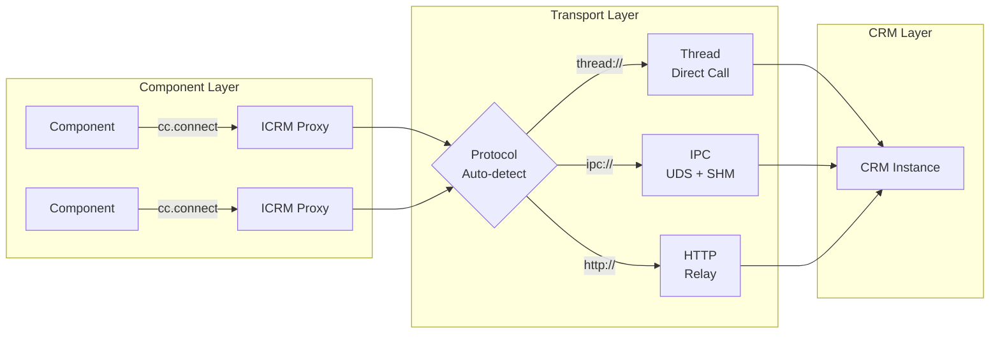
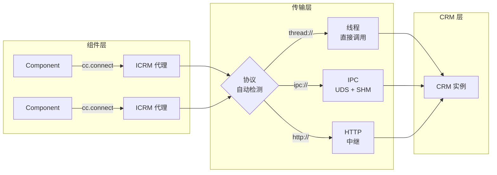

# README Restructure Implementation Plan

> **Status: ✅ COMPLETE** — README.md (English) and README.zh-CN.md (Chinese) written and published.

> **For agentic workers:** This plan is historical — all tasks have been completed.

**Goal:** Rewrite README.md (English) and create README.zh-CN.md (Chinese), following the narrative structure defined in the design spec.

**Architecture:** Single-file replacement for README.md + new README.zh-CN.md. Content draws from existing `examples/local.py`, `examples/server.py`, `examples/client.py`, and `examples/relay/` for code examples, simplified with Counter/Greeter patterns for universal readability.

**Tech Stack:** Markdown, Mermaid diagrams, shields.io badges

**Spec:** `docs/superpowers/specs/2025-07-26-readme-restructure-design.md`

---

## File Structure

| File | Action |
|------|--------|
| `README.md` | Rewrite entirely |
| `README.zh-CN.md` | Create (Chinese translation) |

---

### Task 1: Write English README — Hero, Why, Quick Start, Core Concepts

**Files:**
- Modify: `README.md` (replace all content)

**IMPORTANT:** This task writes only sections §1-§4 to `README.md`. Task 2 appends the remaining sections. Use the `create` tool or overwrite with `edit` — do NOT append to existing content.

- [ ] **Step 1: Write sections §1-§4 to README.md**

Replace the entire `README.md` with the following content (sections §1-§4 only; Task 2 will append §5-§9):

````markdown
<p align="center">
  
</p>

<h1 align="center">C-Two</h1>

<p align="center">
  A resource-oriented RPC framework for Python — turn stateful classes into location-transparent distributed resources.
</p>

<p align="center">
  <a href="https://pypi.org/project/c-two/"></a>
  <a href="https://pypi.org/project/c-two/"></a>
  
  <a href="LICENSE"></a>
</p>

<p align="center">
  <a href="README.zh-CN.md">中文版</a>
</p>

---

## Why C-Two?

- **Resources, not services** — C-Two doesn't expose RPC endpoints. It makes Python classes remotely accessible while preserving their stateful, object-oriented nature.

- **Zero-copy when local, transparent when remote** — Same-process calls skip serialization entirely. Cross-process calls use shared memory. Cross-machine calls go over HTTP. Your code doesn't change.

- **Built for scientific Python** — Native support for Apache Arrow, NumPy arrays, and large payloads (chunked streaming for data beyond 256 MB). Designed for computational workloads, not microservices.

- **Rust-powered transport** — The IPC layer uses a Rust buddy allocator for shared memory and a Rust HTTP relay for high-throughput networking. Python-friendly API, native performance where it counts.

---

## Quick Start

```bash
pip install c-two
```

### Define a resource interface and its implementation

```python
import c_two as cc

# Interface — declares which methods are remotely accessible
@cc.icrm(namespace='demo.counter', version='0.1.0')
class ICounter:
    def increment(self, amount: int) -> int: ...

    @cc.read
    def value(self) -> int: ...

    def reset(self) -> int: ...


# Implementation — a plain Python class holding state
class Counter:
    def __init__(self, initial: int = 0):
        self._value = initial

    def increment(self, amount: int) -> int:
        self._value += amount
        return self._value

    def value(self) -> int:
        return self._value

    def reset(self) -> int:
        old = self._value
        self._value = 0
        return old
```

### Use it locally (zero serialization)

```python
cc.register(ICounter, Counter(initial=100), name='counter')
counter = cc.connect(ICounter, name='counter')

counter.increment(10)    # → 110
counter.value()          # → 110
counter.reset()          # → 110 (returns old value)
counter.value()          # → 0

cc.close(counter)
```

### Or remotely — same API, different address

```python
# Server process
cc.set_address('ipc:///tmp/my_server')
cc.register(ICounter, Counter(), name='counter')

# Client process (separate terminal)
counter = cc.connect(ICounter, name='counter', address='ipc:///tmp/my_server')
counter.increment(5)     # works identically
cc.close(counter)
```

> **See [`examples/`](examples/) for complete runnable demos.**

---

## Core Concepts

### ICRM — Interface

An ICRM (Interface of Core Resource Model) declares which CRM methods are remotely accessible. Decorated with `@cc.icrm()`, method bodies are `...` (pure interface — no implementation).

```python
@cc.icrm(namespace='demo.greeter', version='0.1.0')
class IGreeter:
    @cc.read                              # concurrent reads allowed
    def greet(self, name: str) -> str: ...

    @cc.read
    def language(self) -> str: ...
```

Methods can be annotated with `@cc.read` (concurrent access allowed) or left as default write (exclusive access).

### CRM — Core Resource Model

A CRM is a plain Python class that holds state and implements domain logic. It is **not** decorated — the framework discovers its methods through the ICRM interface.

```python
class Greeter:
    def __init__(self, lang: str = 'en'):
        self._lang = lang
        self._templates = {'en': 'Hello, {}!', 'zh': '你好, {}!'}

    def greet(self, name: str) -> str:
        return self._templates.get(self._lang, 'Hi, {}!').format(name)

    def language(self) -> str:
        return self._lang
```

### Component — Consumer

Components consume CRM resources through ICRM proxies. The proxy is location-transparent — it works the same whether the CRM is in the same process or on a remote machine.

```python
greeter = cc.connect(IGreeter, name='greeter')
greeter.greet('World')     # → '你好, World!'
cc.close(greeter)
```

### @transferable — Custom Serialization

For custom data types that need to cross the wire, use `@cc.transferable`. Without it, pickle is used as fallback.

```python
@cc.transferable
class GridAttribute:
    level: int
    global_id: int
    elevation: float

    def serialize(data: 'GridAttribute') -> bytes:
        # Custom serialization (e.g., Apache Arrow)
        ...

    def deserialize(raw: bytes) -> 'GridAttribute':
        ...
```

> `serialize` and `deserialize` are written as instance-style methods but are automatically converted to `@staticmethod` by the framework.
````

- [ ] **Step 2: Verify sections 1-4 are written correctly**

```bash
head -5 README.md   # should show <p align="center">
grep -c "## " README.md  # should show 5 (Why, Quick Start, Core Concepts + 2 sub-headings)
```

---

### Task 2: Append English README — Examples, Architecture, Installation, Roadmap, License

**Files:**
- Modify: `README.md` (append sections §5-§9 after the content from Task 1)

- [ ] **Step 1: Append sections §5-§9 to README.md**

Append the following content to the end of `README.md` (after the `@transferable` section from Task 1):

````markdown

---

## Examples

### Single Process — Thread Preference

When `cc.connect()` targets a CRM registered in the same process, the proxy calls methods directly with **zero serialization overhead**.

```python
import c_two as cc

# Register two CRMs in the same process
cc.register(IGreeter, Greeter(lang='zh'), name='greeter')
cc.register(ICounter, Counter(initial=100), name='counter')

# Connect — zero-serde thread-local proxies
greeter = cc.connect(IGreeter, name='greeter')
counter = cc.connect(ICounter, name='counter')

print(greeter.greet('World'))    # → 你好, World!
print(counter.value())           # → 100
counter.increment(10)

# Cleanup
cc.close(greeter)
cc.close(counter)
cc.shutdown()
```

> **Best for:** local prototyping, testing, single-machine computation.

### Multi-Process — IPC

Separate server and client processes communicating over Unix domain sockets with shared memory.

**Server** (`server.py`):
```python
import c_two as cc

cc.set_address('ipc://my_server')
cc.register(IGrid, grid_instance, name='grid')
print(f'Listening at {cc.server_address()}')

cc.serve()  # blocks until interrupted
```

**Client** (`client.py`):
```python
import c_two as cc

grid = cc.connect(IGrid, name='grid', address='ipc://my_server')
infos = grid.get_grid_infos(1, [0, 1, 2])
keys = grid.subdivide_grids([1], [0])

cc.close(grid)
cc.shutdown()
```

> **Best for:** multi-process on same host, worker isolation, high-throughput local IPC.

### Cross-Machine — HTTP Relay

An HTTP relay bridges network requests to CRM processes running on IPC.

**CRM Server** (`resource.py`):
```python
import c_two as cc

cc.set_address('ipc://grid_server')
cc.register(IGrid, grid_instance, name='grid')
# Auto-registers with relay when C2_RELAY_ADDRESS is set
cc.serve()
```

**Relay** (`relay.py`):
```python
from c_two.transport.relay import Relay

relay = Relay(bind='127.0.0.1:8080')
relay.start(blocking=True)
```

**Client** (`client.py`):
```python
import c_two as cc

# Same API — just change the address
grid = cc.connect(IGrid, name='grid', address='http://127.0.0.1:8080')
grid.get_grid_infos(1, [0])

cc.close(grid)
```

> **Best for:** network-accessible services, web integration, cross-machine deployment.

---

## Architecture

**The design philosophy of C-Two is not to define services, but to empower resources.**

In scientific computation, resources encapsulating complex state and domain-specific operations need to be organized into cohesive units. We call these **Core Resource Models (CRMs)**. Applications care more about *how to interact* with resources than *where they are located*. We call resource consumers **Components**. C-Two provides location transparency and uniform resource access, allowing components to interact with CRMs as if they were local objects.



### Component Layer

Client-side consumers that access remote resources through ICRM proxies. The proxy provides full type safety and location transparency — components don't know (or care) where the CRM is running.

- **Script-based**: `cc.connect(ICRMClass, name='...', address='...')` returns a typed ICRM proxy
- **Function-based**: `@cc.runtime.connect` decorator injects the ICRM proxy as the first parameter

### CRM Layer

Server-side stateful resources exposed through standardized ICRM interfaces.

- **CRM**: Plain Python class — state + domain logic. Not decorated.
- **ICRM**: Interface class decorated with `@cc.icrm()`. Only methods declared here are remotely accessible.
- **`@transferable`**: Custom serialization for domain data types (e.g., Apache Arrow for scientific data).
- **`@cc.read` / `@cc.write`**: Concurrency annotations — parallel reads, exclusive writes.

### Transport Layer

Protocol-agnostic communication with automatic protocol detection based on address scheme:

| Scheme | Transport | Use case |
|--------|-----------|----------|
| `thread://` | In-process direct call | Zero serialization, testing |
| `ipc:///path` | Unix domain socket + shared memory | Multi-process, same host |
| `http://host:port` | HTTP relay | Cross-machine, web-compatible |

The IPC transport uses a **control-plane / data-plane separation**: method routing flows through UDS inline frames while payload bytes are exchanged via shared memory — zero-copy on the data path.

### Rust Native Layer

Performance-critical components are implemented in Rust and compiled as a Python extension via [PyO3](https://pyo3.rs) + [maturin](https://www.maturin.rs):

- **Buddy Allocator** — Zero-syscall shared memory allocation for the IPC transport. Cross-process, lock-free on the fast path.
- **HTTP Relay** — High-throughput [axum](https://github.com/tokio-rs/axum)-based gateway bridging HTTP to IPC. Handles connection pooling and request multiplexing.

The Rust extension is compiled automatically during `pip install c-two` (from pre-built wheels) or `uv sync` (from source).

---

## Installation

### From PyPI

```bash
pip install c-two
```

Pre-built wheels are available for:
- **Linux**: x86_64, aarch64
- **macOS**: Apple Silicon (aarch64), Intel (x86_64)
- **Python**: 3.10, 3.11, 3.12, 3.13, 3.14, 3.14t (free-threading)

If no pre-built wheel is available for your platform, pip will build from source (requires a [Rust toolchain](https://rustup.rs)).

### Development Setup

```bash
git clone https://github.com/world-in-progress/c-two.git
cd c-two
uv sync          # install dependencies + compile Rust extensions
uv run pytest    # run the test suite
```

> Requires [uv](https://github.com/astral-sh/uv) and a Rust toolchain.

---

## Roadmap

| Feature | Status |
|---------|--------|
| Core RPC framework (CRM / ICRM / Component) | ✅ Stable |
| IPC transport with SHM buddy allocator | ✅ Stable |
| HTTP relay (Rust-powered) | ✅ Stable |
| Chunked streaming (payloads > 256 MB) | ✅ Stable |
| Heartbeat & connection management | ✅ Stable |
| Read/write concurrency control | ✅ Stable |
| CI/CD & multi-platform PyPI publishing | ✅ Stable |
| Async interfaces | 🔜 Planned |
| Disk spill for extreme payloads | 🔜 Planned |
| Cross-language clients (Rust/C++) | 🔮 Future |

See the [full roadmap](docs/plans/c-two-rpc-v2-roadmap.md) for details.

---

## License

[MIT](LICENSE)

---

<p align="center">Built for scientific Python. Powered by Rust.</p>
````

- [ ] **Step 2: Verify the complete README**

```bash
wc -l README.md          # should be ~300-350 lines
grep -c "SOTA" README.md  # MUST be 0
grep -c "mcp\|MCP" README.md  # MUST be 0
grep -c "seed\|Seed\|c3 " README.md  # MUST be 0
grep -c "Wire v2\|Handshake v5\|Protocol v3" README.md  # MUST be 0
grep -c "Legacy\|legacy\|cc.rpc.Server" README.md  # MUST be 0
grep "中文版" README.md  # should show link to README.zh-CN.md
```

- [ ] **Step 3: Commit English README**

```bash
git add README.md
git commit -m "docs: rewrite README with narrative structure

Co-authored-by: Copilot <223556219+Copilot@users.noreply.github.com>"
```

---

### Task 3: Write Chinese README — Sections §1-§4

**Files:**
- Create: `README.zh-CN.md`

Translate the English README into natural, idiomatic Chinese. This is a direct translation, preserving structure and code blocks.

**IMPORTANT:** This task writes only sections §1-§4. Task 4 appends §5-§9. Use the `create` tool.

- [ ] **Step 1: Write sections §1-§4 to README.zh-CN.md**

Create `README.zh-CN.md` with the following content (§1-§4 only):

````markdown
<p align="center">
  
</p>

<h1 align="center">C-Two</h1>

<p align="center">
  面向资源的 Python RPC 框架 — 将有状态的 Python 类转变为位置透明的分布式资源。
</p>

<p align="center">
  <a href="https://pypi.org/project/c-two/"></a>
  <a href="https://pypi.org/project/c-two/"></a>
  
  <a href="LICENSE"></a>
</p>

<p align="center">
  <a href="README.md">English</a>
</p>

---

## 为什么选择 C-Two？

- **面向资源，而非服务** — C-Two 不是暴露 RPC 端点，而是让 Python 类在保持有状态、面向对象特性的同时可被远程访问。

- **本地零拷贝，远程透明** — 同进程调用完全跳过序列化。跨进程调用使用共享内存。跨机器调用走 HTTP。你的代码无需修改。

- **为科学计算而生** — 原生支持 Apache Arrow、NumPy 数组和大体量载荷（超过 256 MB 自动分块流式传输）。专为计算密集型场景设计，而非微服务。

- **Rust 驱动的传输层** — IPC 层使用 Rust 伙伴分配器管理共享内存，HTTP 中继基于 Rust 实现高吞吐网络转发。Python 友好的 API，关键路径上的原生性能。

---

## 快速开始

```bash
pip install c-two
```

### 定义资源接口及其实现

```python
import c_two as cc

# 接口 — 声明哪些方法可被远程访问
@cc.icrm(namespace='demo.counter', version='0.1.0')
class ICounter:
    def increment(self, amount: int) -> int: ...

    @cc.read
    def value(self) -> int: ...

    def reset(self) -> int: ...


# 实现 — 一个持有状态的普通 Python 类
class Counter:
    def __init__(self, initial: int = 0):
        self._value = initial

    def increment(self, amount: int) -> int:
        self._value += amount
        return self._value

    def value(self) -> int:
        return self._value

    def reset(self) -> int:
        old = self._value
        self._value = 0
        return old
```

### 本地使用（零序列化）

```python
cc.register(ICounter, Counter(initial=100), name='counter')
counter = cc.connect(ICounter, name='counter')

counter.increment(10)    # → 110
counter.value()          # → 110
counter.reset()          # → 110（返回旧值）
counter.value()          # → 0

cc.close(counter)
```

### 远程使用 — 相同 API，不同地址

```python
# 服务端进程
cc.set_address('ipc:///tmp/my_server')
cc.register(ICounter, Counter(), name='counter')

# 客户端进程（另一个终端）
counter = cc.connect(ICounter, name='counter', address='ipc:///tmp/my_server')
counter.increment(5)     # 用法完全一致
cc.close(counter)
```

> **完整可运行示例请参阅 [`examples/`](examples/) 目录。**

---

## 核心概念

### ICRM — 接口

ICRM（Interface of Core Resource Model）声明了哪些 CRM 方法可被远程访问。使用 `@cc.icrm()` 装饰，方法体为 `...`（纯接口，无实现）。

```python
@cc.icrm(namespace='demo.greeter', version='0.1.0')
class IGreeter:
    @cc.read                              # 允许并发读取
    def greet(self, name: str) -> str: ...

    @cc.read
    def language(self) -> str: ...
```

方法可标注 `@cc.read`（允许并发访问）或保持默认的 write（独占访问）。

### CRM — 核心资源模型

CRM 是一个普通的 Python 类，持有状态并实现领域逻辑。它**不需要**任何装饰器 — 框架通过 ICRM 接口发现其方法。

```python
class Greeter:
    def __init__(self, lang: str = 'en'):
        self._lang = lang
        self._templates = {'en': 'Hello, {}!', 'zh': '你好, {}!'}

    def greet(self, name: str) -> str:
        return self._templates.get(self._lang, 'Hi, {}!').format(name)

    def language(self) -> str:
        return self._lang
```

### Component — 消费者

Component 通过 ICRM 代理消费 CRM 资源。代理是位置透明的 — 无论 CRM 运行在同进程还是远程机器，用法完全相同。

```python
greeter = cc.connect(IGreeter, name='greeter')
greeter.greet('World')     # → '你好, World!'
cc.close(greeter)
```

### @transferable — 自定义序列化

对于需要跨进程传输的自定义数据类型，使用 `@cc.transferable`。未使用此装饰器时，默认使用 pickle。

```python
@cc.transferable
class GridAttribute:
    level: int
    global_id: int
    elevation: float

    def serialize(data: 'GridAttribute') -> bytes:
        # 自定义序列化（如 Apache Arrow）
        ...

    def deserialize(raw: bytes) -> 'GridAttribute':
        ...
```

> `serialize` 和 `deserialize` 以实例方法风格编写，但框架会自动将它们转换为 `@staticmethod`。
````

- [ ] **Step 2: Verify sections 1-4 are written**

```bash
head -5 README.zh-CN.md
grep "## " README.zh-CN.md | head -5
```

---

### Task 4: Append Chinese README — Sections §5-§9

**Files:**
- Modify: `README.zh-CN.md` (append after Task 3's content)

- [ ] **Step 1: Append sections §5-§9 to README.zh-CN.md**

Append the following content to the end of `README.zh-CN.md`:

````markdown

---

## 使用示例

### 单进程 — 线程偏好模式

当 `cc.connect()` 目标是同进程中注册的 CRM 时，代理直接调用方法，**零序列化开销**。

```python
import c_two as cc

# 在同一进程中注册两个 CRM
cc.register(IGreeter, Greeter(lang='zh'), name='greeter')
cc.register(ICounter, Counter(initial=100), name='counter')

# 连接 — 零序列化的线程本地代理
greeter = cc.connect(IGreeter, name='greeter')
counter = cc.connect(ICounter, name='counter')

print(greeter.greet('World'))    # → 你好, World!
print(counter.value())           # → 100
counter.increment(10)

# 清理
cc.close(greeter)
cc.close(counter)
cc.shutdown()
```

> **适用场景：** 本地原型开发、测试、单机计算。

### 多进程 — IPC

独立的服务端和客户端进程，通过 Unix 域套接字 + 共享内存通信。

**服务端** (`server.py`)：
```python
import c_two as cc

cc.set_address('ipc://my_server')
cc.register(IGrid, grid_instance, name='grid')
print(f'监听地址: {cc.server_address()}')

cc.serve()  # 阻塞直到中断
```

**客户端** (`client.py`)：
```python
import c_two as cc

grid = cc.connect(IGrid, name='grid', address='ipc://my_server')
infos = grid.get_grid_infos(1, [0, 1, 2])
keys = grid.subdivide_grids([1], [0])

cc.close(grid)
cc.shutdown()
```

> **适用场景：** 同主机多进程、Worker 隔离、高吞吐本地 IPC。

### 跨机器 — HTTP 中继

HTTP 中继将网络请求桥接到运行在 IPC 上的 CRM 进程。

**CRM 服务端** (`resource.py`)：
```python
import c_two as cc

cc.set_address('ipc://grid_server')
cc.register(IGrid, grid_instance, name='grid')
# 设置 C2_RELAY_ADDRESS 环境变量后自动注册到中继
cc.serve()
```

**中继** (`relay.py`)：
```python
from c_two.transport.relay import Relay

relay = Relay(bind='127.0.0.1:8080')
relay.start(blocking=True)
```

**客户端** (`client.py`)：
```python
import c_two as cc

# 相同 API — 只需更改地址
grid = cc.connect(IGrid, name='grid', address='http://127.0.0.1:8080')
grid.get_grid_infos(1, [0])

cc.close(grid)
```

> **适用场景：** 网络可访问的服务、Web 集成、跨机器部署。

---

## 架构

**C-Two 的设计哲学不是定义服务，而是赋能资源。**

在科学计算中，封装复杂状态和领域特定操作的资源需要被组织为内聚的单元。我们称这些为 **核心资源模型（CRM）**。应用程序更关心的是 *如何与资源交互*，而非 *资源在哪里*。我们称资源消费者为 **组件（Component）**。C-Two 提供位置透明和统一的资源访问，使组件能够像访问本地对象一样与 CRM 交互。



### 组件层

客户端消费者通过 ICRM 代理访问远程资源。代理提供完整的类型安全和位置透明性 — 组件不需要知道（也不关心）CRM 运行在哪里。

- **脚本式**：`cc.connect(ICRMClass, name='...', address='...')` 返回类型化的 ICRM 代理
- **函数式**：`@cc.runtime.connect` 装饰器自动注入 ICRM 代理作为第一个参数

### CRM 层

服务端有状态资源，通过标准化的 ICRM 接口暴露。

- **CRM**：普通 Python 类 — 状态 + 领域逻辑，无需装饰器。
- **ICRM**：使用 `@cc.icrm()` 装饰的接口类。只有在此声明的方法才可被远程访问。
- **`@transferable`**：领域数据类型的自定义序列化（如 Apache Arrow）。
- **`@cc.read` / `@cc.write`**：并发注解 — 并行读取，独占写入。

### 传输层

协议无关的通信，基于地址方案自动检测协议：

| 协议方案 | 传输方式 | 适用场景 |
|----------|----------|----------|
| `thread://` | 进程内直接调用 | 零序列化、测试 |
| `ipc:///path` | Unix 域套接字 + 共享内存 | 多进程、同主机 |
| `http://host:port` | HTTP 中继 | 跨机器、Web 兼容 |

IPC 传输采用 **控制面 / 数据面分离**：方法路由通过 UDS 内联帧传输，载荷字节通过共享内存交换 — 数据路径上零拷贝。

### Rust 原生层

性能关键组件使用 Rust 实现，通过 [PyO3](https://pyo3.rs) + [maturin](https://www.maturin.rs) 编译为 Python 扩展：

- **伙伴分配器** — IPC 传输的零系统调用共享内存分配。跨进程，快速路径上无锁。
- **HTTP 中继** — 基于 [axum](https://github.com/tokio-rs/axum) 的高吞吐网关，桥接 HTTP 到 IPC。处理连接池和请求多路复用。

Rust 扩展在 `pip install c-two`（从预编译 wheel）或 `uv sync`（从源码）时自动编译。

---

## 安装

### 从 PyPI 安装

```bash
pip install c-two
```

预编译 wheel 支持：
- **Linux**：x86_64、aarch64
- **macOS**：Apple Silicon (aarch64)、Intel (x86_64)
- **Python**：3.10、3.11、3.12、3.13、3.14、3.14t（自由线程）

如果没有适合你平台的预编译 wheel，pip 将从源码编译（需要 [Rust 工具链](https://rustup.rs)）。

### 开发环境

```bash
git clone https://github.com/world-in-progress/c-two.git
cd c-two
uv sync          # 安装依赖 + 编译 Rust 扩展
uv run pytest    # 运行测试套件
```

> 需要 [uv](https://github.com/astral-sh/uv) 和 Rust 工具链。

---

## 路线图

| 功能 | 状态 |
|------|------|
| 核心 RPC 框架（CRM / ICRM / Component） | ✅ 稳定 |
| IPC 传输 + SHM 伙伴分配器 | ✅ 稳定 |
| HTTP 中继（Rust 驱动） | ✅ 稳定 |
| 分块流式传输（载荷 > 256 MB） | ✅ 稳定 |
| 心跳与连接管理 | ✅ 稳定 |
| 读/写并发控制 | ✅ 稳定 |
| CI/CD 与多平台 PyPI 发布 | ✅ 稳定 |
| 异步接口 | 🔜 规划中 |
| 极端载荷磁盘溢出 | 🔜 规划中 |
| 跨语言客户端（Rust/C++） | 🔮 远期 |

详见[完整路线图](docs/plans/c-two-rpc-v2-roadmap.md)。

---

## 开源协议

[MIT](LICENSE)

---

<p align="center">为科学计算而生，由 Rust 驱动。</p>
````

- [ ] **Step 2: Verify the complete Chinese README**

```bash
wc -l README.zh-CN.md     # should be ~300-350 lines
grep -c "SOTA" README.zh-CN.md  # MUST be 0
grep "English" README.zh-CN.md  # should show link to README.md
```

- [ ] **Step 3: Commit Chinese README**

```bash
git add README.zh-CN.md
git commit -m "docs: add Chinese README

Co-authored-by: Copilot <223556219+Copilot@users.noreply.github.com>"
```

---

### Task 5: Final Validation

**Files:**
- Verify: `README.md`, `README.zh-CN.md`

- [ ] **Step 1: Run banned-term check**

```bash
echo "=== Banned terms check ==="
for term in "SOTA" "sota" "Wire v2" "wire_v2" "Handshake v5" "handshake_v5" "Protocol v3" "rpc_v2" "MCP" "mcp" "Seed" "seed" "c3 " "Legacy" "legacy" "cc.rpc.Server" "cc.compo.runtime"; do
  count=$(grep -c "$term" README.md README.zh-CN.md 2>/dev/null | grep -v ":0$" | wc -l)
  if [ "$count" -gt 0 ]; then
    echo "  FAIL: '$term' found"
    grep -n "$term" README.md README.zh-CN.md
  fi
done
echo "=== Done ==="
```

- [ ] **Step 2: Verify cross-links work**

```bash
# Check README.md links to README.zh-CN.md
grep "README.zh-CN.md" README.md
# Check README.zh-CN.md links to README.md
grep "README.md" README.zh-CN.md
# Check both link to examples/
grep "examples/" README.md
grep "examples/" README.zh-CN.md
# Check both link to roadmap
grep "roadmap" README.md
grep "roadmap" README.zh-CN.md
```

- [ ] **Step 3: Verify tests still pass**

```bash
uv run pytest -q --timeout=30 2>&1 | tail -5
```
